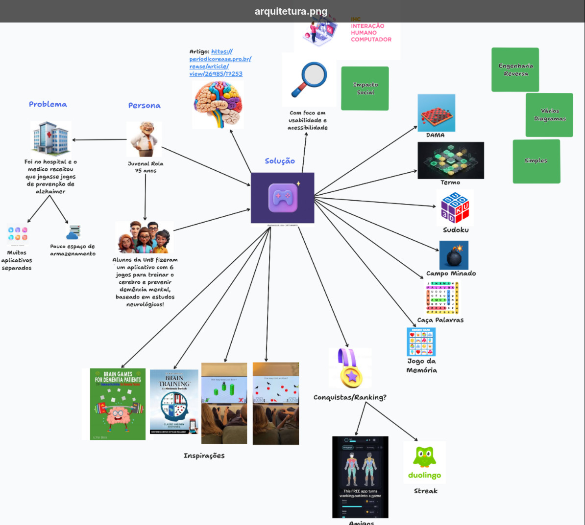
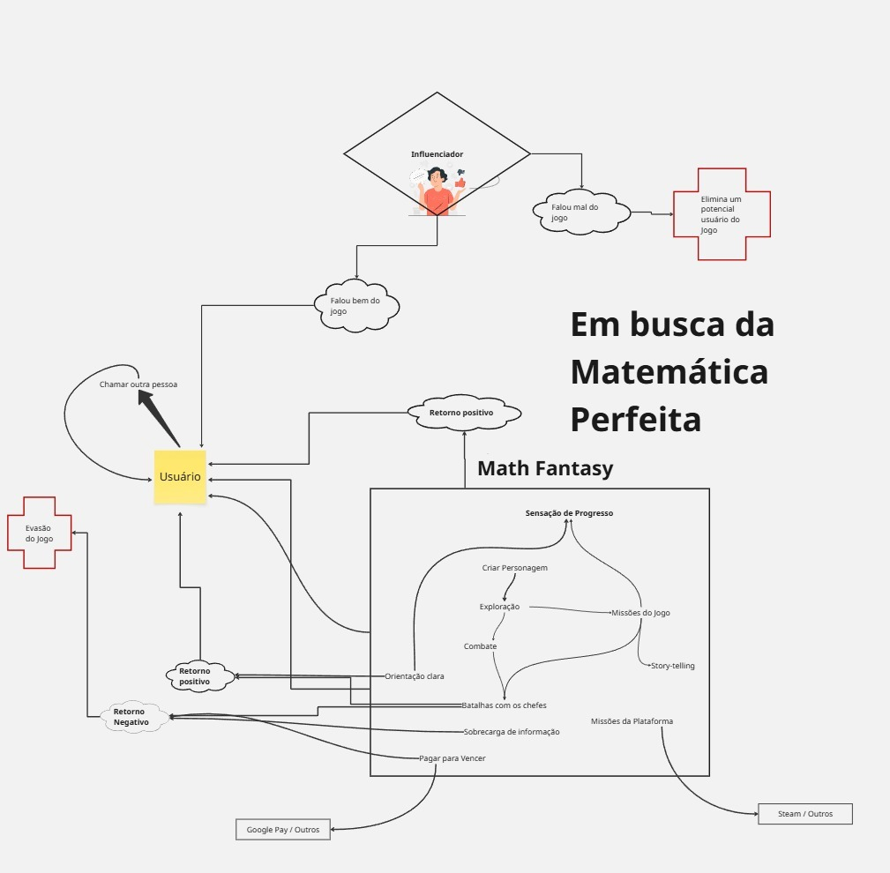
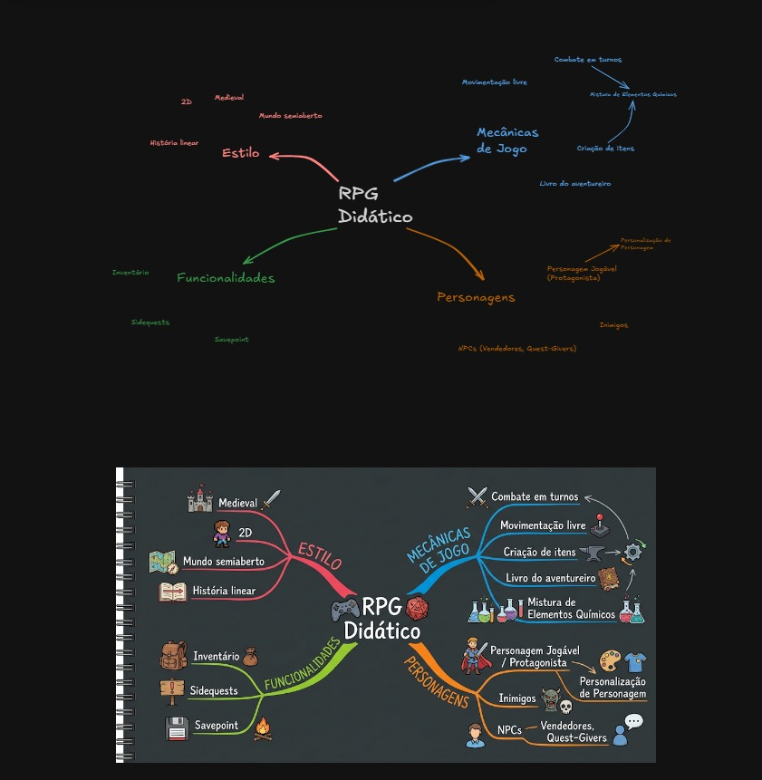

# Sketch

### Introdução

Com base no alinhamento estabelecido nas etapas anteriores, a fase de ***Sketch*** é fundamental para a concepção e visualização das primeiras propostas de solução para o desafio do projeto.

O objetivo desta etapa é materializar ideias e *insights* abstratos em representações visuais concretas. Esse processo permite que os membros da equipe expressem de forma clara, objetiva e acessível suas perspectivas e estratégias para a resolução do problema.

### Metodologia

A execução desta fase ocorreu por meio da elaboração individual de um ***Artefato Generalista*** por subgrupo. O artefato permitiu estruturar visualmente o entendimento de cada membro sobre o contexto, os atores, os processos e as dores identificadas, servindo como base para o esboço e a ideação da aplicação.

****

<b>Autores:</b> [SubGrupo 1](https://unbarqdsw2026-2-turma01.github.io/2026.2-T01-G4_ProjetoJogo_Entrega_01/#/Atas/SubEquipe_01)

****

<b>Autores:</b> [SubGrupo 2](https://unbarqdsw2026-2-turma01.github.io/2026.2-T01-G4_ProjetoJogo_Entrega_01/#/Atas/SubEquipe_02)

****

<b>Autores:</b> [SubGrupo 3](https://unbarqdsw2026-2-turma01.github.io/2026.2-T01-G4_ProjetoJogo_Entrega_01/#/Atas/SubEquipe_03)

### Conclusão

A etapa de ***Sketch*** consolidou as diferentes visões do grupo em modelos visuais tangíveis. A análise comparativa dos *Rich Pictures* e *Mapas Mentais* possibilitou a identificação de padrões, pontos críticos e oportunidades de inovação para o projeto. 

O compartilhamento e a discussão dessas abordagens em equipe promoveram uma síntese colaborativa, expandindo o entendimento do ecossistema do jogo e fundamentando a elicitação de novos requisitos e funcionalidades para a solução final.

## Referência Bibliográfica

> GOOGLE. Design Sprint Kit: Understand. [Acessado em: 25 de ago. 2026](https://designsprintkit.withgoogle.com/methodology/phase1-understand) 

## Histórico de versões
| Versão | Data | Descrição | Autor(es) | Revisor(es) | Data da revisão |
|--------|------|-----------|-----------|-------------|-----------------|
| `1.0` | 18/08/2026 | Criação e organização do documento. | [João Igor](https://github.com/JoaoPC10)  | Marcos Vinícius Gündel da Silva | 27/08/2026 |
| `1.1` | 26/08/2026 | Adição da metodologia, e dos artefatos designados de cada subgrupo | [João Igor](https://github.com/JoaoPC10)  | Marcos Vinícius Gündel da Silva | 27/08/2026 |