# SubEquipe_01: Engenharia Reversa e BPMN

## Descrição

Este artefato documenta a engenharia reversa e a modelagem BPMN da SubEquipe_01 no jogo *Final Fantasy VI*, escolhido como referência na [Ata Geral 02](/Atas/AtaGeral02.md). Foram analisados os fluxos de **equipar itens** e **utilizar itens**. Os fluxos de batalha e lojas permanecem pendentes.

## Objetivo

Identificar atividades, decisões e regras dos fluxos observados para orientar seus modelos BPMN.

## Metodologia

A engenharia reversa analisa um sistema existente para recuperar seus componentes, relações e representações em maior nível de abstração (CHIKOFSKY; CROSS, 1990). Sem acesso ao código-fonte, os fluxos foram executados, gravados e divididos em capturas. As ações visíveis foram registradas como observações; regras internas não demonstradas diretamente foram marcadas como inferências.

Os processos serão modelados segundo a BPMN 2.0.2, que admite a representação de processos existentes e organiza participantes e responsabilidades por elementos como *pools* e *lanes* (OBJECT MANAGEMENT GROUP, 2014).

## Conteúdo

### Escopo dos Fluxos

| Fluxo | Responsável pela análise | Evidências disponíveis | Situação da modelagem BPMN |
|-------|--------------------------|------------------------|----------------------------|
| Equipar itens | Yogi Nam de Souza Barbosa | Vídeo, quatro capturas e BPMN | Concluído |
| Utilizar itens | Yogi Nam de Souza Barbosa | Vídeo e sete capturas | Processo reconstruído; BPMN pendente |
| Batalha | Demais integrantes | Pendente | Pendente |
| Lojas | Demais integrantes | Pendente | Pendente |

<p align="center">Tabela 1: Escopo dos fluxos de engenharia reversa da SubEquipe_01.</p>

### Processo de Engenharia Reversa Aplicado

#### Fluxo 1: Equipar itens

O primeiro fluxo começa no menu principal, passa pela seleção de um personagem e de um espaço de equipamento e termina com a atualização dos equipamentos e atributos apresentados na interface.

<div align="center">
  <video controls playsinline preload="metadata" poster="Base/Relatórios/SubEquipe_01/assets/subgrupo01_equipar_01.jpg" style="width: 100%; max-width: 960px;">
    <source src="Base/Relatórios/SubEquipe_01/assets/subgrupo01-video-equipamentos.mp4" type="video/mp4">
    Seu navegador não oferece suporte à reprodução deste vídeo.
  </video>
</div>

<p align="center">Vídeo 1: Execução do fluxo de equipar itens em Final Fantasy VI. Fonte: gravação de tela produzida por Yogi Nam de Souza Barbosa, 2026.</p>

##### Evidências observadas

| Captura | Ação e estado observados | Comportamento ou regra recuperada |
|---------|--------------------------|-----------------------------------|
| **01**<br>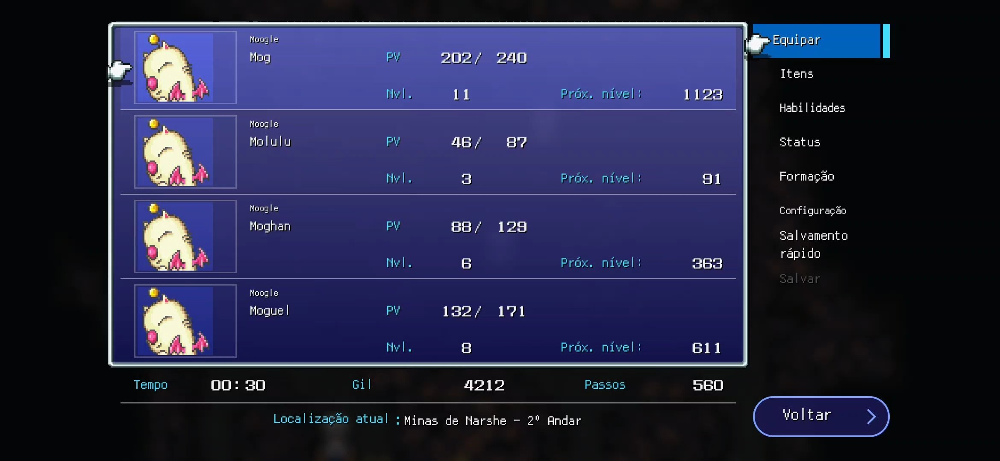 | O jogador destaca **Equipar** no menu principal. A interface exibe os personagens do grupo e seus PV e níveis. | O fluxo começa pela escolha de um personagem. O sistema consulta e apresenta os integrantes disponíveis antes de abrir os espaços de equipamento. |
| **02**<br>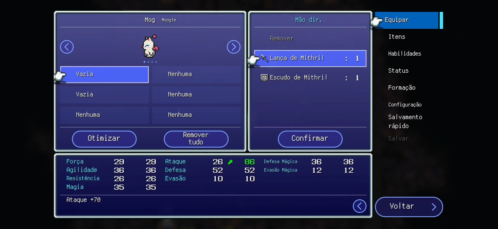 | Mog foi selecionado. O espaço **Mão dir.** está ativo e a lista oferece `Remover`, `Lança de Mithril` e `Escudo de Mithril`. | Ao selecionar um espaço, o sistema apresenta opções associadas a ele e permite esvaziá-lo. A lista indica a existência de uma consulta de itens equipáveis para o personagem e o espaço selecionados. |
| **03**<br>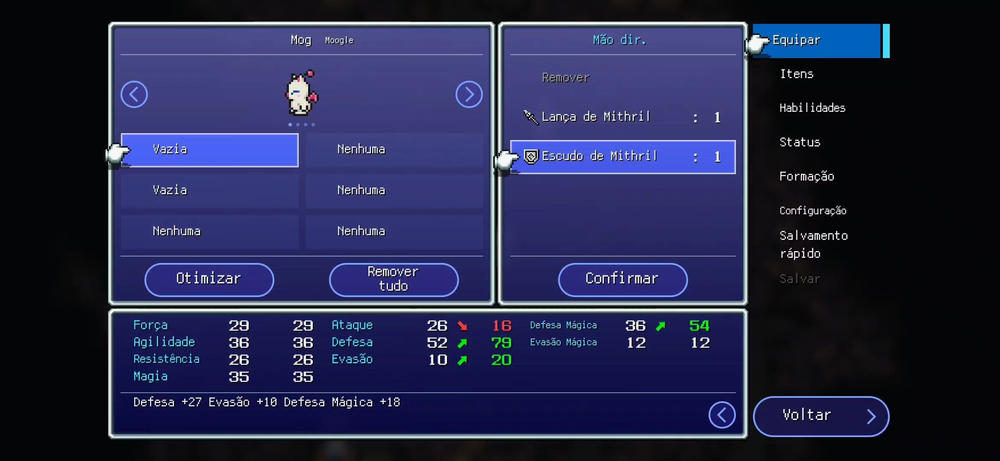 | O jogador destaca `Escudo de Mithril`. Ataque diminui, enquanto Defesa, Evasão e Defesa Mágica aumentam, com diferenças indicadas por cores e setas. | A seleção produz uma simulação dos atributos resultantes antes da confirmação. A prévia não deve persistir a alteração enquanto o jogador apenas navega entre as opções. |
| **04**<br>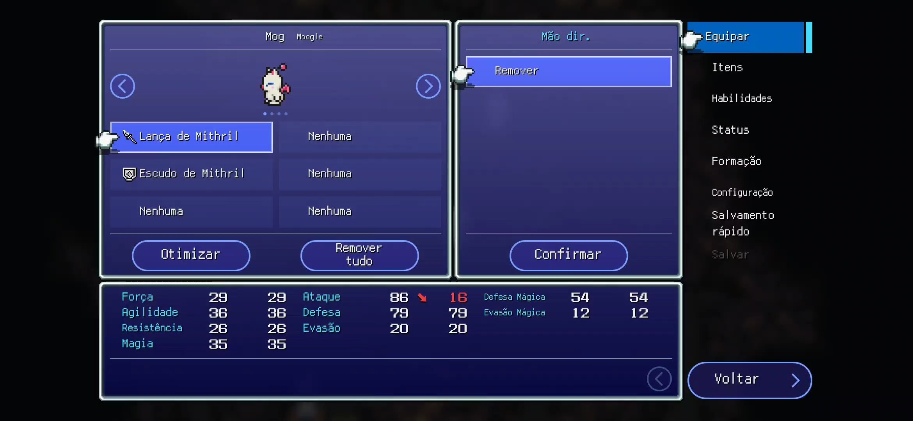 | `Lança de Mithril` e `Escudo de Mithril` aparecem ocupando espaços de Mog. Ao selecionar o espaço ocupado, a opção `Remover` é oferecida. | A confirmação persiste o equipamento no personagem e recalcula os atributos efetivos. Um espaço ocupado pode ser esvaziado ou receber outro item em operação posterior. |

<p align="center">Tabela 2: Evidências do fluxo de equipar itens. Fonte: capturas da gravação de Final Fantasy VI produzida por Yogi Nam de Souza Barbosa, 2026.</p>

##### Processo reconstruído

```text
Abrir menu → selecionar Equipar → selecionar personagem → selecionar espaço
→ consultar itens aplicáveis → selecionar item ou remover → calcular prévia
→ confirmar ou cancelar → persistir alteração → recalcular atributos
→ atualizar interface
```

#### Fluxo 2: Utilizar itens

O segundo fluxo parte do menu principal e percorre a consulta do inventário, a seleção de um item, a validação de seu uso e, quando necessário, a seleção de um alvo. O vídeo também apresenta funções secundárias de organização e consulta de itens-chave.

<div align="center">
  <video controls playsinline preload="metadata" poster="Base/Relatórios/SubEquipe_01/assets/subgrupo01_itens_01.jpg" style="width: 100%; max-width: 960px;">
    <source src="Base/Relatórios/SubEquipe_01/assets/subgrupo01-video-itens.mp4" type="video/mp4">
    Seu navegador não oferece suporte à reprodução deste vídeo.
  </video>
</div>

<p align="center">Vídeo 2: Execução do fluxo de utilizar itens em Final Fantasy VI. Fonte: gravação de tela produzida por Yogi Nam de Souza Barbosa, 2026.</p>

##### Evidências observadas

| Captura | Ação e estado observados | Comportamento ou regra recuperada |
|---------|--------------------------|-----------------------------------|
| **01**<br> | O jogador está no menu principal, com a opção `Itens` disponível. | O sistema mantém acesso ao grupo, à localização atual e ao inventário antes da abertura da tela de itens. |
| **02**<br>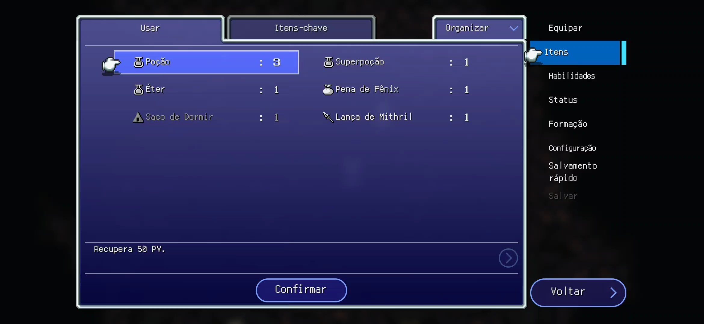 | A aba `Usar` apresenta itens e quantidades. A Poção possui quantidade 3 e a descrição `Recupera 50 PV.` | O inventário reúne diferentes categorias. Ao destacar um item, o sistema consulta e apresenta seus metadados, como nome, quantidade e descrição do efeito. |
| **03**<br>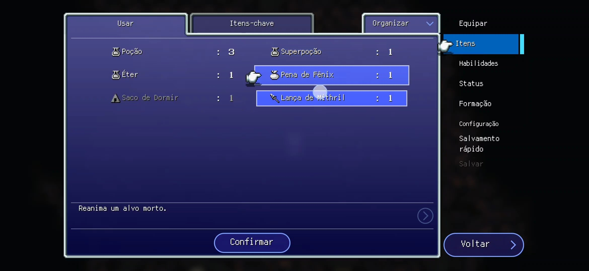 | A `Pena de Fênix` possui a descrição `Reanima um alvo morto.` | Itens possuem efeitos e critérios de alvo distintos. O efeito descrito indica que a validade do alvo depende do estado do personagem. |
| **04**<br>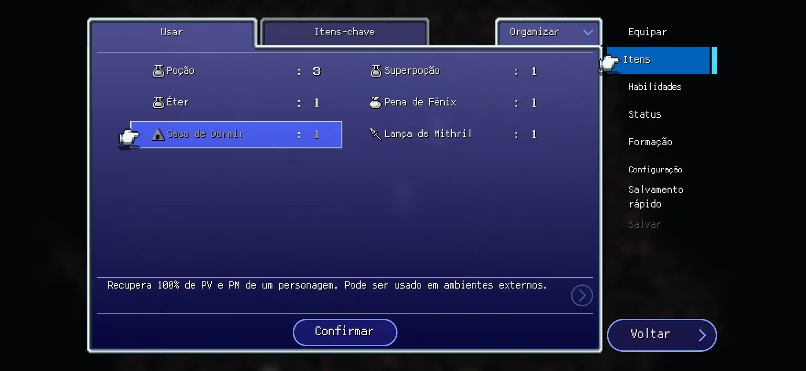 | O `Saco de Dormir` aparece acinzentado, com um símbolo de alerta. A descrição informa que ele recupera 100% de PV e PM e pode ser usado em ambientes externos. | A interface indica uma pré-condição contextual. Como o grupo está em `Minas de Narshe: 2º Andar`, infere-se que o uso é bloqueado por não estar em ambiente externo. O bloqueio deve ser confirmado em testes adicionais. |
| **05**<br>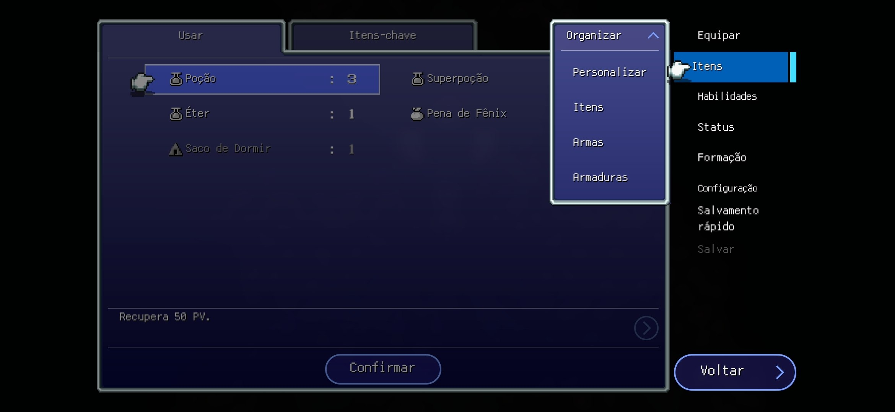 | O menu `Organizar` oferece `Personalizar`, `Itens`, `Armas` e `Armaduras`. | A ordenação ou classificação do inventário constitui um fluxo auxiliar de apresentação e não demonstra alteração de quantidade ou efeito dos itens. |
| **06**<br>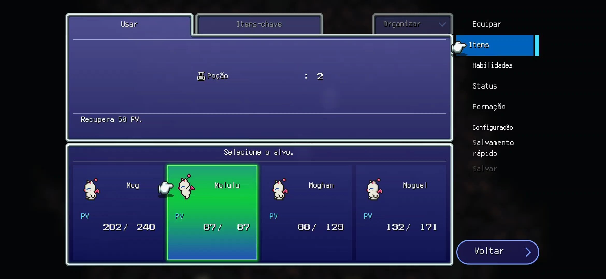 | A Poção está associada à seleção de alvo. Molulu aparece com 87/87 PV e a quantidade disponível é 2. Antes do uso, Molulu tinha 46/87 PV e havia 3 Poções. | A sequência indica que o sistema validou o alvo, aplicou a cura com limite no PV máximo, consumiu uma unidade e atualizou personagem, inventário e interface. |
| **07**<br>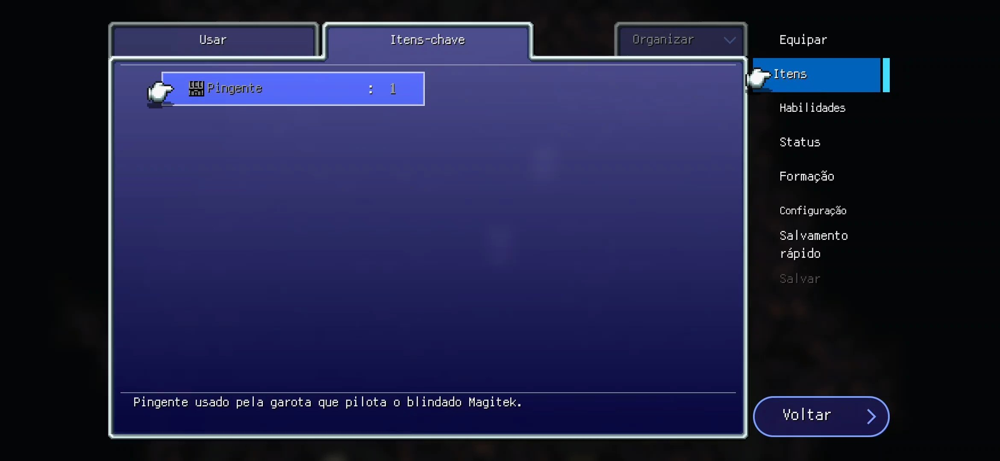 | A aba `Itens-chave` apresenta o `Pingente` e sua descrição narrativa, sem o mesmo comando de confirmação exibido para consumíveis. | Itens-chave formam uma categoria de consulta e não seguem necessariamente o fluxo de consumo e seleção de alvo. |

<p align="center">Tabela 3: Evidências do fluxo de utilizar itens. Fonte: capturas da gravação de Final Fantasy VI produzida por Yogi Nam de Souza Barbosa, 2026.</p>

##### Processo reconstruído

```text
Abrir menu → selecionar Itens → carregar inventário → selecionar item
→ validar uso no contexto
  → uso bloqueado: sinalizar indisponibilidade e retornar à seleção
  → uso permitido: confirmar → verificar necessidade de alvo
    → selecionar e validar alvo → executar efeito → consumir unidade
    → atualizar inventário e interface
```

### Modelagem BPMN

#### Equipar item

O modelo separa os participantes **Jogador** e **Sistema do jogo** em dois *pools*. O fluxo representa a seleção de personagem e espaço, as alternativas de otimizar ou remover equipamentos, a simulação dos atributos, a confirmação da escolha e a atualização do personagem, inventário e interface.

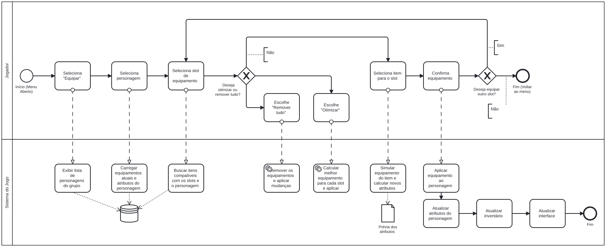

<p align="center">Figura 1: Modelo BPMN do fluxo de equipar item. Fonte: Yogi Nam de Souza Barbosa, 2026.</p>

## Referências

BARBOSA, Yogi Nam de Souza. **Execução dos fluxos de equipar e utilizar itens em Final Fantasy VI** [gravações de tela]. 2026. Arquivos: `assets/subgrupo01-video-equipamentos.mp4` e `assets/subgrupo01-video-itens.mp4`.

CHIKOFSKY, Elliot J.; CROSS II, James H. **Reverse engineering and design recovery: a taxonomy**. *IEEE Software*, v. 7, n. 1, p. 13-17, 1990. DOI: [10.1109/52.43044](https://doi.org/10.1109/52.43044).

OBJECT MANAGEMENT GROUP. **Business Process Model and Notation (BPMN), Version 2.0.2**. 2014. Disponível em: <https://www.omg.org/spec/BPMN/2.0.2/PDF/>. Acesso em: 26 ago. 2026.

SQUARE ENIX. **Final Fantasy VI Pixel Remaster** [jogo eletrônico]. 2022. Disponível em: <https://www.square-enix-games.com/en_US/home/final-fantasy-vi-now-available-steam-mobile>. Acesso em: 26 ago. 2026.

## Nível de Contribuição dos Integrantes

| Nome | % de Contribuição |
|------|-------------------|
| Cibelly Lourenço Ferreira | 33,4% |
| Gabriel Andrade Magioli | 33,3% |
| Yogi Nam de Souza Barbosa | 33,3% |

<p align="center">Tabela 4: Contribuição dos integrantes.</p>

## Histórico de Versão

| Versão | Data | Descrição | Autor(es) | Revisor |
|:------:|------|:----------|:----------|:--------|
| 1.0 | 22/08/2026 | Criação da página no modelo do artefato padrão | Marcelo de Araújo Lopes | |
| 1.1 | 26/08/2026 | Documentação da engenharia reversa dos fluxos de equipar e utilizar itens | Yogi Nam de Souza Barbosa | |
| 1.2 | 26/08/2026 | Inserção do modelo BPMN do fluxo de equipar item | Yogi Nam de Souza Barbosa | |

<p align="center">Tabela 5: Histórico de versão.</p>

Ver também: [Ata Geral 02](/Atas/AtaGeral02.md) · [Artefato Generalista](ArtefatoGeneralista.md) · [Rich Picture](RichPicture.md) · [NFR Framework](NFRFramework.md) · [IA Generativa](IAGenerativa.md)
