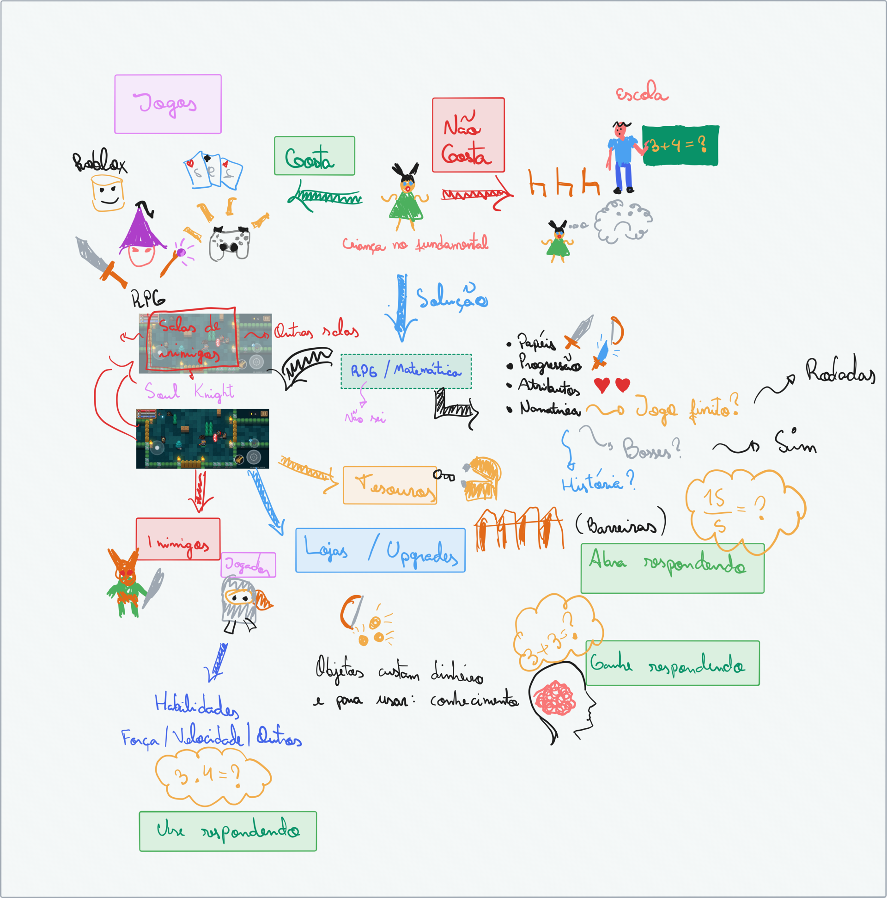
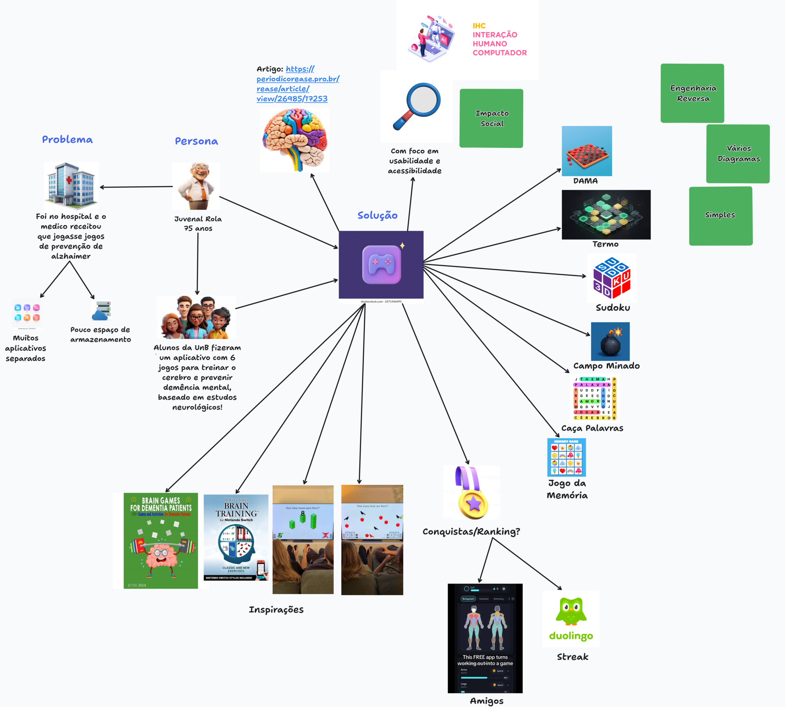

# SubEquipe_01: Rich Picture

## Descrição

Artefato generalista da SubEquipe_01, no escopo do **FOCO_01**. O *Rich Picture* é uma representação visual informal que combina desenhos, símbolos, relações e anotações para explicitar atores, preocupações e diferentes interpretações de uma situação complexa (MONK; HOWARD, 1998).

As duas versões preservadas nesta página registram a evolução das propostas do subgrupo. A primeira explora um RPG educacional baseado em matemática; a segunda representa uma plataforma integrada de jogos de estimulação cognitiva. Portanto, elas não são apenas refinamentos gráficos de uma mesma solução, mas alternativas elaboradas e discutidas pelo Subgrupo 01 antes da escolha coletiva do conceito do projeto.

## Objetivo

Externalizar as ideias, dúvidas e preocupações levantadas pelo Subgrupo 01, apoiar o entendimento compartilhado das propostas e fornecer evidências para a escolha do conceito do projeto. A informalidade do *Rich Picture* foi empregada intencionalmente para favorecer a discussão antes da adoção de modelos mais precisos, conforme o uso da técnica para raciocinar sobre contextos de trabalho descrito por Monk e Howard (1998).

## Metodologia

A elaboração ocorreu de forma iterativa e colaborativa no [tldraw](https://www.tldraw.com/), quadro branco digital que oferece desenho livre, formas, textos, imagens e conectores em uma tela compartilhada (TLDRAW, 2026). Esses recursos permitiram registrar relações e incertezas sem impor a sintaxe de uma notação formal, em consonância com a natureza exploratória do *Rich Picture*.

A **versão 1** partiu do direcionamento da [Ata Geral 01](/Atas/AtaGeral01.md): um jogo educacional de impacto social, inicialmente concebido como RPG 2D com desafios de matemática. O esboço foi apresentado e discutido na [reunião do Subgrupo 01](/Atas/AtaSub01_01.md). Para organizar a ideia, foram representados mundo e salas, personagem, inimigos, atributos, progressão, objetos, lojas, barreiras e narrativa. Esses elementos dialogam com características recorrentes de RPG identificadas por Hitchens e Drachen (2008), como mundo imaginário, personagens controlados pelo jogador, desenvolvimento do personagem, variedade de interações e sequência narrativa.

Durante a mesma reunião, o subgrupo avaliou a complexidade e a adequação da primeira proposta. A experiência relatada por Cibelly Lourenço sobre a dificuldade de seu pai em manter vários jogos no celular motivou uma mudança de escopo. A **versão 2** foi então construída coletivamente em torno de uma plataforma que reuniria seis jogos: Dama, Termo, Sudoku, Campo Minado, Caça-palavras e Jogo da Memória. O foco estava em usabilidade e acessibilidade, além de possibilidades de conquistas, ranking, interação entre amigos e *streaks*.

O artigo de Araújo e Araújo (2026), incorporado como referência na versão 2, apresenta jogos digitais como recursos complementares que podem mobilizar memória de trabalho, atenção, planejamento, flexibilidade cognitiva e tomada de decisão quando planejados, adaptados e supervisionados. Essa conclusão sustenta a investigação sobre **estimulação cognitiva**, mas não comprova prevenção ou tratamento de demência. Assim, a linguagem de “prevenção” presente no esboço deve ser entendida como hipótese levantada na ideação, ainda dependente de validação científica e profissional.

Por fim, a versão 2 foi apresentada na reunião geral de 21/08/2026. Conforme a [Ata Geral 02](/Atas/AtaGeral02.md), o grupo reconheceu a mudança de paradigma, comparou as propostas das três subequipes e escolheu por votação o artefato da SubEquipe 03. A manutenção das duas versões nesta página documenta as alternativas consideradas pelo Subgrupo 01 e o insumo levado à decisão coletiva.

## Conteúdo

### Versão 1: RPG educacional de matemática

A primeira versão combina referências de jogos digitais como o jogo [Soul Knight](https://soulknight.chillyroom.com/et) com uma proposta de RPG educacional. O fluxo visual parte da ideia de jogo, contrapõe custo e gratuidade e associa a dificuldade de aprendizagem de matemática a uma solução com exploração de salas, combate, inimigos, tesouros, habilidades, atributos, progressão e desafios matemáticos. As interrogações mantidas no desenho evidenciam decisões que ainda estavam abertas, como narrativa, duração, chefes e barreiras.

Figura 1: Versão 1 do Rich Picture de RPG educacional de matemática. Fonte: Cibelly Lourenço Ferreira, Gabriel Andrade Magioli e Yogi Nam de Souza Barbosa, 2026.

### Versão 2: Plataforma de jogos de estimulação cognitiva

A segunda versão organiza a situação em torno de uma persona idosa, da recomendação de atividades cognitivas, da fragmentação em diversos aplicativos e da limitação de armazenamento. A solução proposta centraliza seis jogos, considera acessibilidade e usabilidade e registra inspirações e mecanismos de engajamento. Os blocos sobre impacto social, simplicidade, engenharia reversa e produção de diagramas também conectam a proposta ao contexto da disciplina.

Figura 2: Versão 2 do Rich Picture da plataforma de jogos de estimulação cognitiva. Fonte: Cibelly Lourenço Ferreira, Gabriel Andrade Magioli e Yogi Nam de Souza Barbosa, 2026.

> **Limitação da versão 2:** a referência consultada descreve potencial de estimulação cognitiva como recurso complementar, planejado e supervisionado. O artefato não deve ser interpretado como evidência de que jogos previnem ou tratam Alzheimer ou outras demências.

Embora outra proposta tenha sido escolhida na reunião geral, conceitos comuns da versão 1, como combate, itens, equipamentos e HUD, reaparecem no [NFR Framework](NFRFramework.md) e nos fluxos recuperados por [Engenharia Reversa e BPMN](BPMN.md).

## Referências

ARAÚJO, Anna Clara Castro; ARAÚJO, Carla Patrícia Santos. **Cérebro em jogo: a estimulação cognitiva por meio de jogos digitais em idosos com Alzheimer**. *Revista Ibero-Americana de Humanidades, Ciências e Educação*, v. 12, n. 5, p. 1–20, 2026. DOI: [10.51891/rease.v12i5.26985](https://doi.org/10.51891/rease.v12i5.26985). Acesso em: 26 ago. 2026.

HITCHENS, Michael; DRACHEN, Anders. **The many faces of role-playing games**. *International Journal of Role-Playing*, n. 1, p. 3–21, 2008. DOI: [10.33063/ijrp.vi1.185](https://doi.org/10.33063/ijrp.vi1.185).

MONK, Andrew F.; HOWARD, Steve. **Methods & tools: the rich picture: a tool for reasoning about work context**. *Interactions*, v. 5, n. 2, p. 21–30, 1998. DOI: [10.1145/274430.274434](https://doi.org/10.1145/274430.274434).

TLDRAW. **tldraw: collaborative digital whiteboard** [software]. Disponível em: <https://www.tldraw.com/>. Acesso em: 26 ago. 2026.

## Nível de Contribuição dos Integrantes

| Nome | % de Contribuição |
|------|-------------------|
| Cibelly Lourenço Ferreira | 33,4% |
| Gabriel Andrade Magioli | 33,3% |
| Yogi Nam de Souza Barbosa | 33,3% |

Tabela 1: Contribuição dos integrantes.

## Histórico de Versão

| Versão | Data | Descrição | Autor(es) | Revisor |
|:------:|------|:----------|:----------|:--------|
| 1.0 | 22/08/2026 | Criação da página no modelo do artefato padrão | Marcelo de Araújo Lopes | Marcos Vinícius Gündel da Silva |
| 1.1 | 26/08/2026 | Documentação e publicação das duas versões do Rich Picture | Cibelly Lourenço Ferreira, Gabriel Andrade Magioli e Yogi Nam de Souza Barbosa | Marcos Vinícius Gündel da Silva |
| 1.2 | 26/08/2026 | Remoção de referências metodológicas descontinuadas e inclusão da iniciativa experimental com IA | Yogi Nam de Souza Barbosa | Marcos Vinícius Gündel da Silva |
| 1.3 | 28/08/2026 | Correção da autoria e inclusão da rastreabilidade com os demais artefatos | Yogi Nam de Souza Barbosa | Marcos Vinícius Gündel da Silva |

Tabela 2: Histórico de versão.

Ver também: [Experimento com IA](RichPictureIA.md) · [NFR Framework](NFRFramework.md) · [Engenharia Reversa e BPMN](BPMN.md) · [IA Generativa](IAGenerativa.md)
