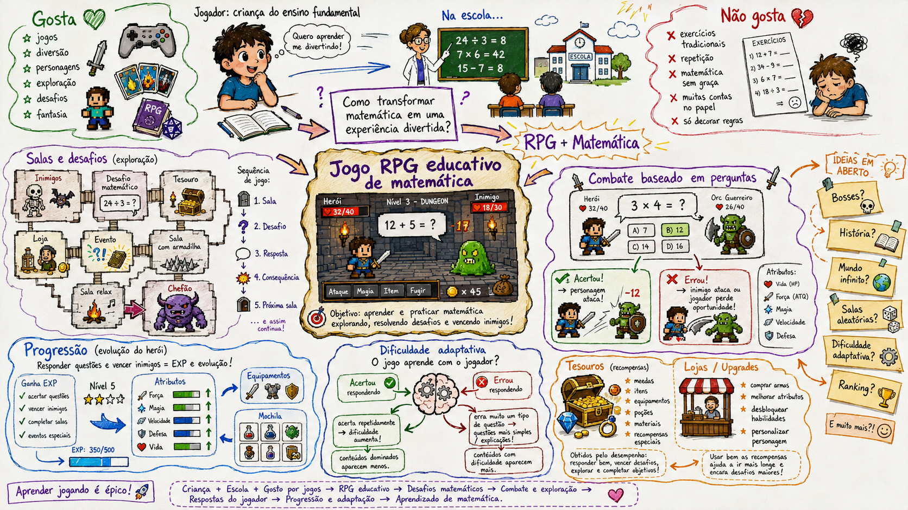
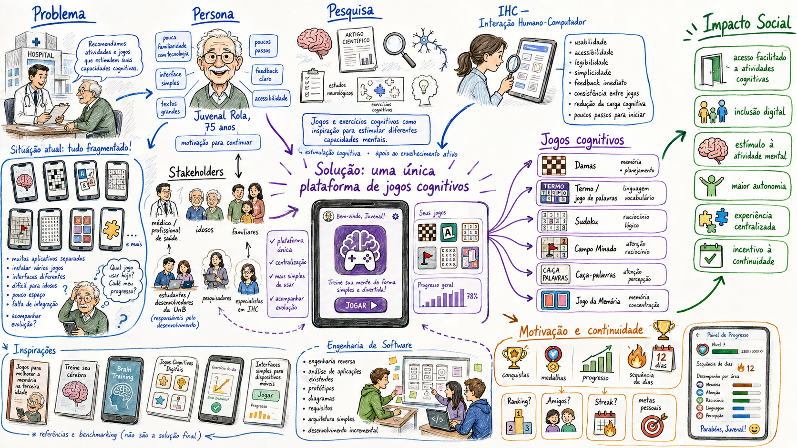

# SubEquipe_01: Experimento de recriação de Rich Pictures com IA

## Descrição

Esta iniciativa extra registra um experimento do Subgrupo 01 com ferramentas de IA generativa. O grupo descreveu em linguagem natural os dois [Rich Pictures originais](RichPicture.md) e utilizou os textos como comandos para tentar produzir novas representações visuais dos mesmos conceitos.

As imagens desta página são resultados experimentais. Elas não substituem os Rich Pictures elaborados colaborativamente no tldraw nem alteram a autoria e a rastreabilidade dos artefatos originais.

## Objetivo

Avaliar qualitativamente se uma IA generativa conseguiria reconstruir o conteúdo conceitual dos Rich Pictures a partir apenas de descrições textuais, observando a cobertura das ideias, a organização visual, a aderência à natureza informal da técnica e as limitações do processo.

## Metodologia

Inicialmente, o grupo examinou cada Rich Picture original e produziu um prompt detalhado com seus atores, problemas, relações, soluções, incertezas e direção visual. O arquivo `docs/Base/Relatórios/SubEquipe_01/prompt_01.txt` descreve o RPG educacional de matemática, enquanto `docs/Base/Relatórios/SubEquipe_01/prompt_02.txt` descreve a plataforma de jogos de estimulação cognitiva.

A primeira tentativa foi realizada no [Cloudairy](https://cloudairy.com/), plataforma recomendada pela professora Milene Serrano e apresentada por seus responsáveis como um ambiente apoiado por IA para diagramas, imagens e colaboração. Nenhum Rich Picture foi obtido antes que os créditos disponíveis fossem consumidos. O tamanho e o nível de detalhamento dos prompts foram considerados pelo grupo como uma possível causa, mas o experimento não produziu evidências suficientes para confirmar essa explicação ou concluir que a plataforma seja incapaz de gerar esse tipo de artefato.

Em seguida, os mesmos prompts foram submetidos ao ChatGPT, com o modelo **GPT-5.6 Sol Alto**, que gerou as duas imagens apresentadas nesta página. Como o processo partiu das descrições textuais, e não do envio dos desenhos originais como referência visual, os resultados devem ser entendidos como **reconstruções semânticas**, não como reprodução ou edição direta das imagens criadas no tldraw.

Para a análise, foram observados quatro aspectos: preservação dos conceitos descritos, clareza da organização visual, presença de relações e incertezas típicas de um Rich Picture e necessidade de revisão humana.

## Resultados

### Experimento 1: RPG educacional de matemática

O resultado preserva o público infantil, o contexto escolar, a tensão entre diversão e exercícios tradicionais e a ideia central de combinar RPG e matemática. Também organiza salas, combate baseado em perguntas, progressão, dificuldade adaptativa, recompensas e decisões ainda abertas. Em comparação com o original, a composição apresenta uma hierarquia visual mais regular e maior detalhamento das possíveis interfaces do jogo.

Figura 1: Recriação experimental do Rich Picture do RPG educacional de matemática. Fonte: ChatGPT, modelo GPT-5.6 Sol Alto, a partir de prompt elaborado pelo Subgrupo 01, 2026.

Prompt utilizado: `docs/Base/Relatórios/SubEquipe_01/prompt_01.txt`.

### Experimento 2: Plataforma de jogos de estimulação cognitiva

O segundo resultado preserva o problema da fragmentação dos aplicativos, a persona idosa, os demais envolvidos, a pesquisa, os requisitos de IHC, a plataforma centralizada, os seis jogos, os mecanismos de motivação e o impacto social pretendido. A linguagem visual também mantém a cautela solicitada no prompt ao priorizar “estimulação cognitiva” e “apoio ao envelhecimento ativo”, em vez de apresentar prevenção ou cura como resultados comprovados.

Figura 2: Recriação experimental do Rich Picture da plataforma de jogos de estimulação cognitiva. Fonte: ChatGPT, modelo GPT-5.6 Sol Alto, a partir de prompt elaborado pelo Subgrupo 01, 2026.

Prompt utilizado: `docs/Base/Relatórios/SubEquipe_01/prompt_02.txt`.

## Análise Crítica e Lições Aprendidas

| Aspecto | Observação |
|---------|------------|
| Cobertura conceitual | As imagens recuperaram a maior parte dos elementos explicitamente enumerados nos prompts e organizaram relações suficientes para comunicar as duas propostas. |
| Legibilidade | A divisão em regiões, o uso consistente de cores e os títulos facilitaram a leitura, especialmente quando comparados ao caráter mais espontâneo dos desenhos originais. |
| Aderência à técnica | Apesar da estética manual, os resultados se aproximam de infográficos muito organizados. Parte da ambiguidade, dos conflitos e das relações cruzadas que caracterizam um Rich Picture produzido durante uma discussão foi reduzida. |
| Influência do prompt | Os resultados refletem prompts extensos e prescritivos. Assim, a boa cobertura não pode ser atribuída somente à IA: a análise prévia e a descrição produzida pelo grupo foram determinantes. |
| Editabilidade | Os resultados foram exportados como imagens rasterizadas e não possuem a mesma facilidade de edição colaborativa do arquivo original no tldraw. Alterações exigem nova geração ou edição posterior. |
| Confiabilidade | A coerência visual não valida requisitos, viabilidade técnica nem alegações pedagógicas ou médicas. Todo conteúdo gerado precisa ser confrontado com as decisões do grupo e com referências adequadas. |
| Limites do experimento | A tentativa no Cloudairy não gerou uma saída comparável, e apenas uma configuração do ChatGPT foi avaliada. Portanto, o experimento não permite uma comparação geral entre plataformas ou modelos. |

Tabela 1: Síntese da avaliação qualitativa dos resultados. Fonte: Cibelly, Gabriel e Yogi, 2026.

O experimento indicou que a IA pode ajudar a reorganizar e comunicar visualmente uma concepção já bem descrita, além de revelar elementos que o grupo pode incorporar em revisões futuras. Entretanto, ela não substitui a construção colaborativa: os Rich Pictures originais registram o raciocínio, as divergências e as decisões ocorridas durante a reunião, enquanto as imagens geradas representam uma interpretação posterior dos prompts.

## Referências

CLOUDAIRY. **All-in-One AI Canvas** [software]. Disponível em: <https://cloudairy.com/>. Acesso em: 26 ago. 2026.

MONK, Andrew F.; HOWARD, Steve. **Methods & tools: the rich picture: a tool for reasoning about work context**. *Interactions*, v. 5, n. 2, p. 21–30, 1998. DOI: [10.1145/274430.274434](https://doi.org/10.1145/274430.274434).

OPENAI. **ChatGPT** [software]. Disponível em: <https://chatgpt.com/overview/>. Acesso em: 26 ago. 2026.

## Nível de Contribuição dos Integrantes

| Nome | % de Contribuição |
|------|-------------------|
| Cibelly Lourenço Ferreira | 33,4% |
| Gabriel Andrade Magioli | 33,3% |
| Yogi Nam de Souza Barbosa | 33,3% |

Tabela 2: Contribuição dos integrantes.

## Histórico de Versão

| Versão | Data | Descrição | Autor(es) | Revisor |
|:------:|------|:----------|:----------|:--------|
| 1.0 | 26/08/2026 | Criação da página e documentação do experimento de recriação dos Rich Pictures com IA | Yogi Nam de Souza Barbosa | |

Tabela 3: Histórico de versão.

Ver também: [Rich Pictures originais](RichPicture.md) · [IA Generativa](IAGenerativa.md) · [Ata da reunião do Subgrupo 01](/Atas/AtaSub01_01.md)
