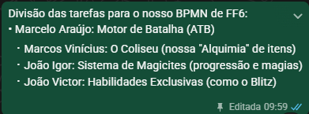
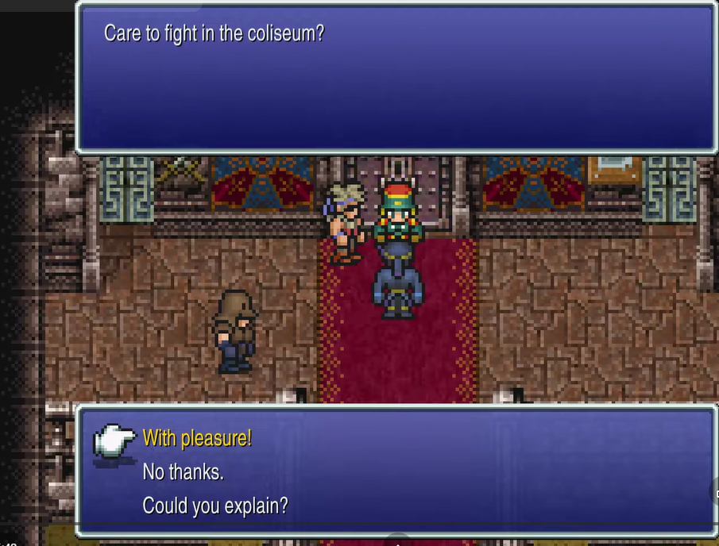
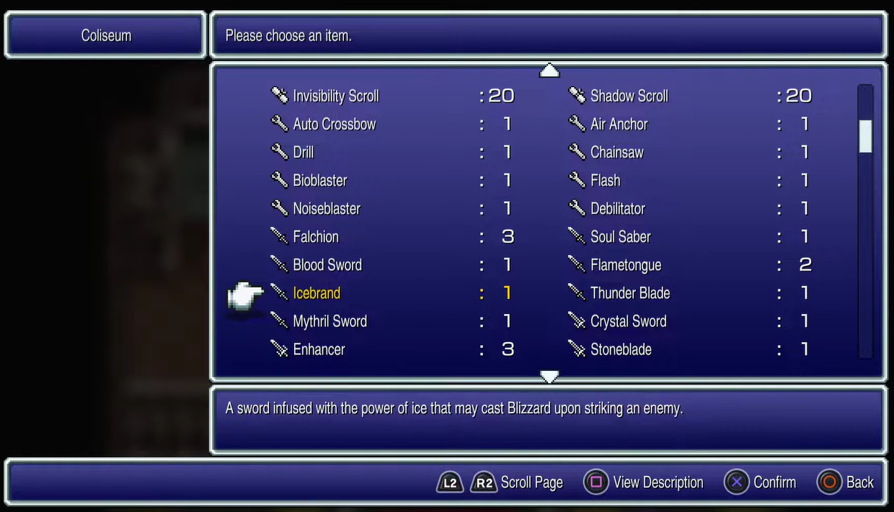
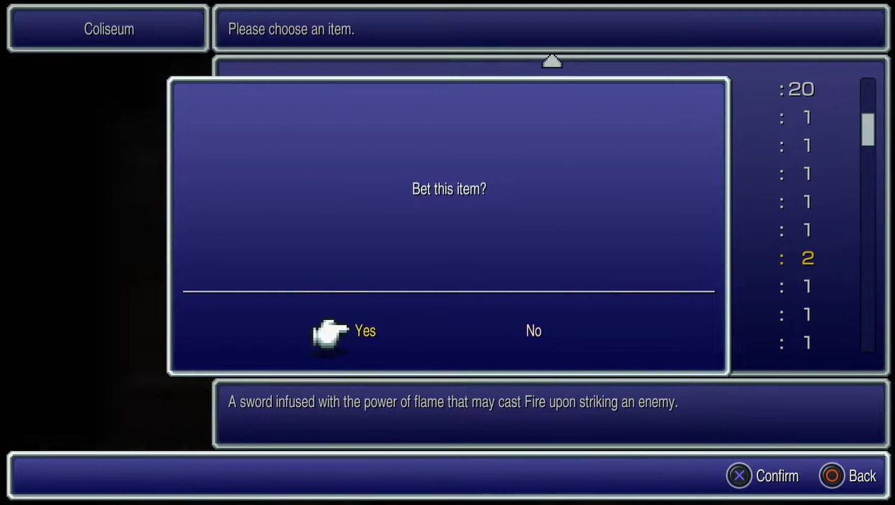
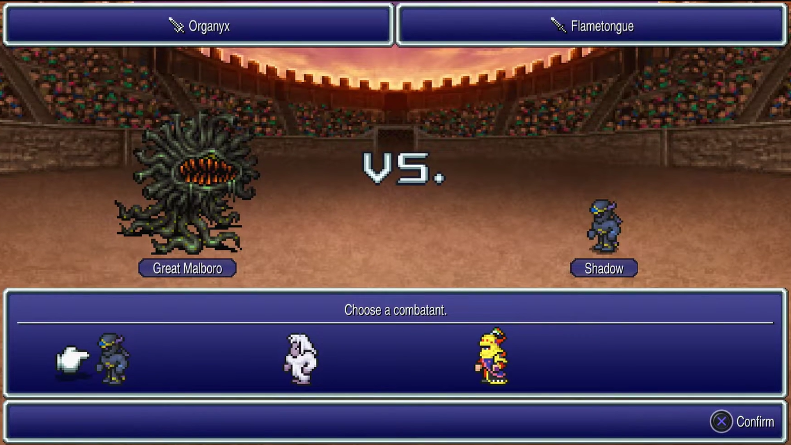
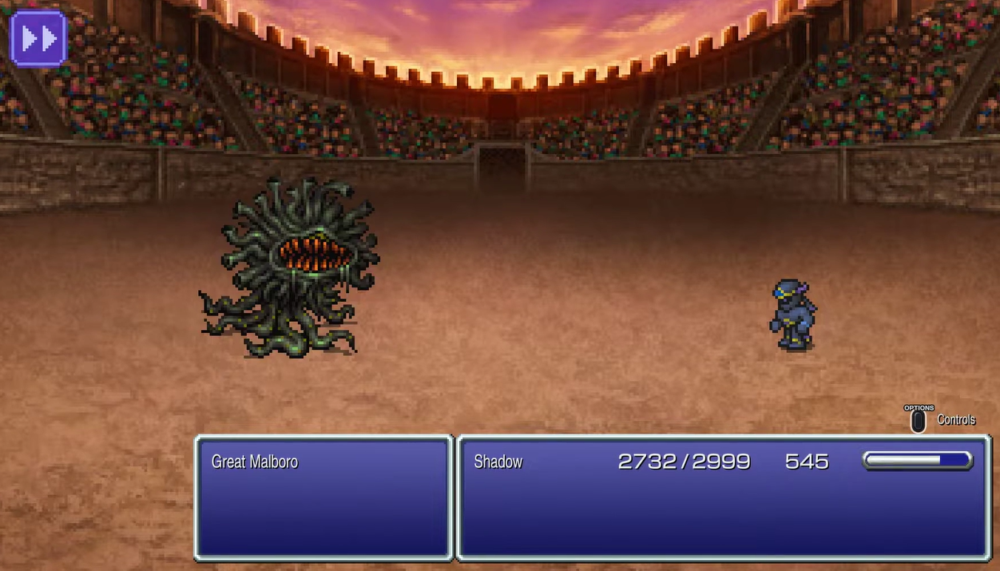
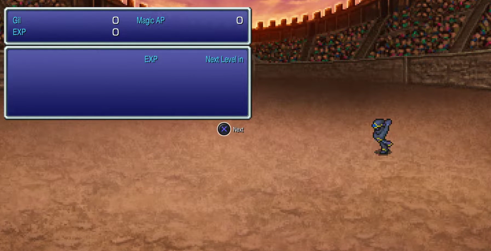
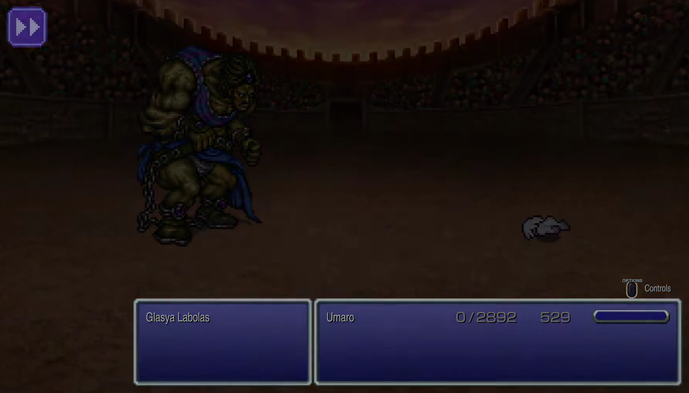

# SubEquipe_02 — BPMN

## Descrição

Modelagem de processo de negócio da SubEquipe_02, no escopo do **FOCO_02 — Engenharia Reversa & Modelagem BPMN**. Representa, na notação BPMN, fluxos de sistemas do jogo **Final Fantasy VI**, escolhido pela subequipe como objeto de Engenharia Reversa. Cada integrante ficou responsável por um sistema do jogo.

## Objetivo

Modelar em BPMN um fluxo identificado durante o processo de Engenharia Reversa, evidenciando as atividades, os eventos e os pontos de decisão do processo.

## Metodologia

A Engenharia Reversa foi conduzida com base na literatura *(BRAGA; PENTEADO, [s. d.])*, que a define como o "processo de exame e compreensão do software existente, para recapturar ou recriar o projeto e decifrar os requisitos atualmente implementados pelo sistema, apresentando-os em um nível ou grau mais alto de abstração". Como a subequipe não possui acesso ao código-fonte do jogo, foi adotada uma abordagem de Engenharia Reversa por observação da caixa-preta (*black-box*): assistir ao software em execução, catalogar sistematicamente os elementos de interface e as transições de tela, e inferir as regras de negócio a partir do comportamento observado, etapas detalhadas na seção [Processo de Engenharia Reversa Aplicado](#processo-de-engenharia-reversa-aplicado).

O jogo escolhido pela subequipe foi **Final Fantasy VI**. Os sistemas do jogo a serem modelados em BPMN foram divididos entre os quatro integrantes conforme definido em conversa da equipe (Figura 1):

Figura 1: Divisão dos sistemas de FF6 entre os integrantes da SubEquipe_02. Fonte: Conversa da equipe (WhatsApp), 2026.

- Marcelo Araújo: Motor de Batalha (ATB)
- Marcos Vinícius: O Coliseu (nossa "Alquimia" de itens)
- João Igor: Sistema de Magicites (progressão e magias)
- João Victor: Habilidades Exclusivas (como o Blitz)

Cada integrante aplica individualmente o processo de Engenharia Reversa descrito acima ao seu sistema. A seguir, a metodologia específica de cada um.

### Motor de Batalha (ATB)

*A ser preenchido.*

### O Coliseu

Para o levantamento do fluxo do Coliseu, foi assistido o vídeo *"Final Fantasy 6 Pixel Remaster #41 - Coliseum"* (CARNAGE PANDA, 2022), do canal **carnage panda**, no YouTube. A partir do vídeo, foram extraídas capturas de tela de cada decisão e transição do fluxo de aposta do Coliseu, reunidas na pasta `assets` deste documento e utilizadas como evidência para a listagem dos elementos de interface, o registro das transições de estado e a inferência das regras de negócio apresentadas na próxima seção.

### Sistema de Magicites

Para a obtenção dos recursos necessários, foi utilizado como fonte o [vídeo](https://www.youtube.com/watch?v=TMMd1fNsKG4), publicado no canal **Solanus Dracon**, no YouTube. A partir desse material, foram extraídas informações sobre o funcionamento das Magicites, suas formas de obtenção e utilização, bem como sobre o sistema de afinidades associado a elas.

### Habilidades Exclusivas

*A ser preenchido.*

## Conteúdo

### Processo de Engenharia Reversa Aplicado

#### Coliseu

As capturas de tela a seguir, extraídas do vídeo do canal carnage panda (CARNAGE PANDA, 2022), documentam a sequência completa do fluxo de aposta do Coliseu. Para cada uma, são listados os elementos de interface, as transições de estado e as regras de negócio identificados naquela etapa específica.

Figura 2: Diálogo inicial do guarda da entrada do Coliseu. Fonte: CARNAGE PANDA, 2022.

**Elementos de Interface**

- Caixa de diálogo do guarda, exibindo a pergunta "Care to fight in the coliseum?".
- Menu textual de resposta com três opções: "With pleasure!", "No thanks." e "Could you explain?", exibido como uma segunda caixa sobreposta à caixa de diálogo, sem ocultá-la.

**Transições de Estado**

- A caixa de pergunta do guarda **não é ocultada** quando o menu de respostas surge: as duas caixas ficam visíveis simultaneamente, caracterizando uma sobreposição (*overlay*) e não uma substituição de tela.
- Ao clicar em "Could you explain?", o software exibe uma explicação textual das mecânicas do Coliseu e, em seguida, **retorna** à mesma pergunta inicial do guarda, configurando um laço (*loop*) no fluxo.
- Ao clicar em "No thanks.", o fluxo é encerrado e a tela retorna ao jogo normal, fora do Coliseu.
- Ao clicar em "With pleasure!", a tela do guarda é substituída integralmente pela tela de seleção de item para aposta (Figura 3).

Figura 3: Lista de itens do inventário disponíveis para aposta. Fonte: CARNAGE PANDA, 2022.

**Elementos de Interface**

- Lista/aba de itens do inventário do jogador disponíveis para aposta, rolada verticalmente.

**Transições de Estado**

- Ao clicar em um item da lista, o software **não remove** o item nem avança diretamente, em vez disso, sobrepõe o modal de confirmação "Bet this item?" (Figura 4).

**Regras de Negócio**

- A lista de itens apostáveis é composta exclusivamente pelos itens presentes no inventário atual do jogador, não há itens exclusivos do Coliseu na lista.

**Base de Dados Inferida**

- **Leitura (Read):** Para popular a lista da interface, o sistema realiza uma consulta de leitura na base de dados "Inventário do Jogador", filtrando os itens disponíveis para aposta e excluindo itens que já estão equipados.

Figura 4: Modal de confirmação do item apostado. Fonte: CARNAGE PANDA, 2022.

**Elementos de Interface**

- Modal de confirmação da aposta, com a pergunta "Bet this item?" e as opções "Yes" / "No".

**Transições de Estado**

- Clicar em "No" fecha o modal e retorna à tela de seleção de item (Figura 3).
- Clicar em "Yes" avança para a tela de seleção de personagem (Figura 5).

**Regras de Negócio**

- O item apostado só é efetivamente removido do inventário no momento em que um personagem é selecionado para o combate (Figura 5), e não neste momento de confirmação, ou seja, a aposta só se torna irreversível quando o combate está prestes a começar.

Figura 5: Seleção do personagem combatente, com item apostado, item de recompensa e adversário exibidos. Fonte: CARNAGE PANDA, 2022.

**Elementos de Interface**

- Painéis superiores fixos com o item apostado (ex.: "Flametongue") e o item prometido como recompensa (ex.: "Organyx").
- Rótulo central "VS." com o nome do adversário (ex.: "Great Malboro") e o nome do personagem em destaque (ex.: "Shadow").
- Lista de seleção com cursor, exibindo todos os personagens da party atual disponíveis para o combate, e botão de confirmação "Confirm".

**Transições de Estado**

- Qualquer escolha de personagem da party avança para a tela de combate automático (Figura 6), não há opção de retorno a essa altura do fluxo.

**Regras de Negócio**

- Apenas um personagem da party atual participa do combate por vez: o Coliseu isola o combatente selecionado, mesmo que a party tenha múltiplos membros disponíveis.

**Base de Dados Inferida**

- **Leitura (Read):** O sistema consulta a base de dados "'Party' do Jogador" para listar os personagens atualmente disponíveis e aptos para a arena.
- **Atualização/Deleção (Update/Delete):** No exato momento em que o jogador confirma o personagem, o sistema executa a remoção definitiva do item apostado da base de dados "Inventário do Jogador".

Figura 6: Combate automático entre o personagem escolhido e o adversário. Fonte: CARNAGE PANDA, 2022.

**Elementos de Interface**

- Arena de combate automático, sem menu de comandos do jogador.

**Transições de Estado**

- Ao final do combate, a tela é substituída pela tela de vitória (Figura 7) ou de derrota (Figura 8), dependendo do resultado, sem intervenção do jogador durante a transição.

**Regras de Negócio**

- O jogador **não tem controle** sobre as ações do personagem durante o combate: a batalha do Coliseu é inteiramente automática/simulada pelo sistema, ao contrário do combate ATB padrão do modo aventura.

Figura 7: Tela de vitória, com a entrega do item de recompensa. Fonte: CARNAGE PANDA, 2022.

**Elementos de Interface**

- Tela de resultado de vitória, com animação do personagem e contadores de Gil, EXP e Magic AP ganhos.

**Regras de Negócio**

- Em caso de vitória, os ganhos usuais de batalha são zerados (0 de Gil, 0 de EXP e 0 de Magic AP) e, em seu lugar, o jogador recebe o item prometido como recompensa: o Coliseu segue, portanto, uma lógica de recompensa própria, distinta do combate convencional.

**Base de Dados Inferida**

- **Escrita (Create/Insert):** O sistema insere o novo item (recompensa) na base de dados "Inventário do Jogador".

Figura 8: Tela de derrota, sem concessão de recompensa. Fonte: CARNAGE PANDA, 2022.

**Elementos de Interface**

- Transição "Fade to black" ao final da animação de derrota do personagem.

**Regras de Negócio**

- Em caso de derrota, o item apostado é **permanentemente perdido** (não retorna ao inventário) e nenhuma recompensa é concedida, caracterizando uma mecânica de risco: o jogador aposta um item na expectativa de ganhar outro, podendo perder o que apostou.

#### Sistema de Magicite em Final Fantasy VI

O sistema de **Magicite** de *Final Fantasy VI* está diretamente relacionado aos **Espers**, permitindo que os personagens aprendam magias, recebam bônus permanentes de atributos e invoquem os respectivos Espers durante as batalhas.

**O que é Magicite?**

A **Magicite** representa a essência de um Esper e pode ser equipada pelos personagens. Ao equipá-la, o personagem passa a ter acesso à invocação daquele Esper durante as batalhas, podendo causar dano aos inimigos, aplicar efeitos positivos ao grupo ou produzir outros efeitos especiais.

Além da possibilidade de invocação, cada Magicite possui características próprias relacionadas ao **aprendizado de magias** e, em alguns casos, à **evolução dos atributos do personagem**.

**Aprendizado de Magias e Taxa de Aquisição**

Cada Esper associado a uma Magicite pode ensinar uma ou mais magias. Para cada magia existe uma **taxa de aquisição**, que determina a quantidade de **Magic AP** necessária para aprendê-la.

Ao final de cada batalha, o personagem equipado com uma Magicite recebe Magic AP. Esse valor é utilizado para aumentar o percentual de aprendizado das magias ensinadas pela Magicite.

A taxa funciona da seguinte maneira:

- **Taxa 10:** cada Magic AP representa 10% de aprendizado, sendo necessários 10 Magic AP para aprender a magia completamente.
- **Taxa 5:** cada Magic AP representa 5% de aprendizado, sendo necessários 20 Magic AP.
- **Taxa 2:** cada Magic AP representa 2% de aprendizado, sendo necessários 50 Magic AP.

Por exemplo:

| Magia | Taxa de aquisição | Magic AP necessários |
|:---|:---:|:---:|
| Thunder | 10% | 10 |
| Poison | 5% | 20 |
| Thundara | 2% | 50 |

A Magicite deve permanecer equipada enquanto o personagem estiver adquirindo Magic AP. Quando a magia atingir **100% de aprendizado**, ela é permanentemente adicionada ao repertório do personagem e continua disponível mesmo após a remoção da Magicite.

**Múltiplos Espers ensinando a mesma magia**

Uma mesma magia pode ser ensinada por diferentes Espers, sendo que cada um pode apresentar uma **taxa de aquisição diferente**.

Isso permite que o jogador escolha estrategicamente qual Magicite equipar de acordo com as magias que deseja aprender mais rapidamente.

Alguns exemplos são:

- **Ramuh:** ensina Thunder com uma taxa específica de aquisição.
- **Maduin:** ensina as magias elementais de segundo nível, como Thundara, Fira e Blizzara, com taxa 3.
- **Bismarck:** ensina as magias elementais de primeiro nível, como Thunder, Blizzard e Fire, com taxa 20, exigindo apenas 5 Magic AP para o aprendizado completo.

Dessa forma, o jogador pode otimizar a distribuição das Magicites de acordo com as necessidades de cada personagem.

**Bônus de Atributos ao Subir de Nível**

Além do aprendizado de magias, algumas Magicites concedem **bônus permanentes de atributos** quando o personagem sobe de nível enquanto está equipado com elas.

Entre os exemplos estão:

- **Ramuh:** +1 de Stamina por nível adquirido.
- **Sylph/Siren:** +10% de HP ganho ao subir de nível.
- **Kirin/Cactuar:** +1 de Magic por nível adquirido.

Esse sistema possibilita uma estratégia mais avançada de desenvolvimento dos personagens. O jogador pode trocar as Magicites antes de determinados níveis para direcionar o crescimento dos atributos e, consequentemente, construir personagens com valores elevados de **HP, MP, Magic ou Stamina**.

**Estratégia de Progressão e Grinding**

Uma estratégia utilizada por jogadores que desejam otimizar os atributos dos personagens consiste em evitar ganhar níveis excessivamente cedo no jogo.

Isso ocorre porque os bônus de atributos fornecidos pelas Magicites são aplicados **no momento em que o personagem sobe de nível**. Portanto, subir de nível antes de obter Magicites com bônus mais vantajosos pode resultar na perda de oportunidades de otimização dos atributos.

Assim, alguns jogadores procuram avançar pelo jogo mantendo os personagens em níveis relativamente baixos até alcançar o **World of Ruin**, período em que uma quantidade maior de Magicites está disponível. A partir desse momento, torna-se possível planejar os níveis seguintes e utilizar diferentes Magicites para maximizar os atributos desejados.

**Empilhamento de Taxas com Equipamentos**

Alguns equipamentos também podem contribuir para o aprendizado de determinadas magias. Quando o equipamento e a Magicite ensinam a mesma magia, suas taxas podem ser **combinadas**, reduzindo o número de batalhas necessárias para completar o aprendizado.

Um exemplo é a magia **Ultima**:

- **Escudo Paladin:** taxa de 1%.
- **Magicite Ragnarok:** taxa de 1%.
- **Ambos equipados:** taxa combinada de 2%.

Nesse caso, o personagem precisaria de aproximadamente **50 Magic AP**, em vez dos 100 necessários quando possui apenas uma fonte com taxa de 1%.

**Objetivo e Resultado do Sistema**

O sistema de Magicite cria uma relação entre **progressão, personalização e estratégia**. O jogador precisa decidir quais Magicites equipar, quais magias deseja priorizar e, em determinados momentos, quais atributos deseja desenvolver.

Com tempo suficiente e um planejamento adequado, é possível fazer com que diferentes personagens aprendam uma grande variedade de magias e desenvolvam atributos elevados. Como consequência, os personagens tornam-se mais **flexíveis e intercambiáveis**, permitindo diferentes combinações e estratégias durante a progressão e, principalmente, no conteúdo de final de jogo.

### Modelagem BPMN

*Inserir aqui o modelo BPMN do fluxo levantado, com legenda e fonte.*

Figura 9: Modelo BPMN do fluxo de &lt;&lt;nome do fluxo&gt;&gt;. Fonte: Autores, 2026.

## Referências

BRAGA, Rosana T. Vaccare; PENTEADO, Rosângela. **Engenharia Reversa e Reengenharia**. Material da disciplina SCE 186 – Engenharia de Software. [S. l.: s. n.], [s. d.].

CARNAGE PANDA. **Final Fantasy 6 Pixel Remaster #41 - Coliseum**. YouTube, 5 abr. 2022. Disponível em: https://www.youtube.com/watch?v=vAIxn-R0GFM. Acesso em: 25 ago. 2026.

## Nível de Contribuição dos Integrantes

| Nome | % de Contribuição |
|------|-------------------|
| Marcos Vinícius Gündel da Silva | |

Tabela 1: Contribuição dos integrantes. Fonte: Autores, 2026.

## Histórico de Versão

| Versão | Data | Descrição | Autor(es) | Revisor |
|:------:|------|:----------|:----------|:--------|
| 1.0 | 22/08/2026 | Criação da página no modelo do artefato padrão | Marcelo de Araújo Lopes | Marcos Vinícius Gündel da Silva |
| 1.1 | 25/08/2026 | Preenchimento do processo de Engenharia Reversa aplicado ao Coliseu (FF6): metodologia e, para cada tela do fluxo, os elementos de interface, as transições de estado e as regras de negócio identificados | Marcos Vinícius Gündel da Silva | |
| 1.2 | 26/08/2026 | Preenchimento do processo de Engenharia Reversa aplicado ao Sistema de Magicites (FF6): metodologia e conteúdo gerado | João Igor Pereira da Costa | |
| 1.3 | 26/08/2026 | Adição dos comandos do Banco de Dados Inferido por tela no processo de Engenharia Reversa do Coliseu | Marcos Vinícius Gündel da Silva | |

Tabela 2: Histórico de versão. Fonte: Autores, 2026.

Ver também: [Artefato Generalista](ArtefatoGeneralista.md) · [Léxico](Lexico.md) · [Rich Picture](RichPicture.md) · [NFR Framework](NFRFramework.md) · [IA Generativa](IAGenerativa.md)
