# SubEquipe_02 — BPMN

## Descrição

Modelagem de processo de negócio da SubEquipe_02, no escopo do **FOCO_02 — Engenharia Reversa & Modelagem BPMN**. Representa, na notação BPMN, fluxos de sistemas do jogo **Final Fantasy VI**, escolhido pela subequipe como objeto de Engenharia Reversa. Cada integrante ficou responsável por um sistema do jogo.

## Objetivo

Modelar em BPMN um fluxo identificado durante o processo de Engenharia Reversa, evidenciando as atividades, os eventos e os pontos de decisão do processo.

## Metodologia

A Engenharia Reversa foi conduzida com base na literatura (BRAGA; PENTEADO, [s. d.]), que a define como o "processo de exame e compreensão do software existente, para recapturar ou recriar o projeto e decifrar os requisitos atualmente implementados pelo sistema, apresentando-os em um nível ou grau mais alto de abstração". Como a subequipe não possui acesso ao código-fonte do jogo, foi adotada uma abordagem de Engenharia Reversa por observação da caixa-preta (black-box): assistir ao software em execução, catalogar sistematicamente os elementos de interface e as transições de tela, e inferir as regras de negócio a partir do comportamento observado, etapas detalhadas na seção [Processo de Engenharia Reversa Aplicado](#processo-de-engenharia-reversa-aplicado).

O jogo escolhido pela subequipe foi **Final Fantasy VI**. Os sistemas do jogo a serem modelados em BPMN foram divididos entre os quatro integrantes conforme definido em conversa da equipe (Figura 1):

Figura 1: Divisão dos sistemas de FF6 entre os integrantes da SubEquipe_02. Fonte: Conversa da equipe (WhatsApp), 2026.

- Marcelo Araújo: Motor de Batalha (ATB)
- Marcos Vinícius: O Coliseu (nossa "Alquimia" de itens)
- João Igor: Sistema de Magicites (progressão e magias)
- João Victor: Habilidades Exclusivas (como o Blitz)

Cada integrante aplica individualmente o processo de Engenharia Reversa descrito acima ao seu sistema. A seguir, a metodologia específica de cada um.

### Motor de Batalha (ATB)

Para o levantamento do fluxo do Motor de Batalha, optou-se por **gravar uma partida do próprio jogo** em vez de recorrer a vídeos de terceiros. Foi utilizada uma gravação produzida pela equipe, na qual se registra um ciclo completo de batalha na versão Pixel Remaster em português: o encontro no mapa, o preenchimento da barra de ATB, a escolha de comando, a execução de uma magia, a derrota do inimigo, a tela de recompensa e o retorno à exploração.

A gravação foi então percorrida quadro a quadro e, de cada etapa do fluxo, extraiu-se uma captura de tela em resolução nativa, reunidas na pasta `assets` deste documento. O uso de material próprio permitiu **controlar quais situações seriam observadas** — no caso, um início de batalha por emboscada, que evidencia a existência de tipos distintos de início.

Em termos das técnicas descritas na literatura, trata-se de **análise dinâmica**: sem acesso ao código-fonte, o comportamento é recuperado observando o programa **em execução**, e não pela leitura estática de seus artefatos. Não houve descompilação, desassemblagem nem qualquer acesso ao binário do jogo: a observação limitou-se à interface exibida ao jogador, para fins exclusivamente acadêmicos.

Sobre essas capturas foram listados os elementos de interface, registradas as transições de estado e inferidas as regras de negócio e as operações de leitura e escrita em base de dados apresentadas na próxima seção. Sempre que possível, as inferências foram **confrontadas com valores numéricos visíveis na própria tela** — por exemplo, a queda de 979 para 928 pontos de magia após o uso de um feitiço de custo 51 confirma o débito de PM no instante da execução. O fluxo assim recuperado foi o insumo para a modelagem BPMN em três frames apresentada adiante.

### O Coliseu

Para o levantamento do fluxo do Coliseu, foi assistido o vídeo "Final Fantasy 6 Pixel Remaster #41 - Coliseum" (CARNAGE PANDA, 2022), do canal **carnage panda**, no YouTube. A partir do vídeo, foram extraídas capturas de tela de cada decisão e transição do fluxo de aposta do Coliseu, reunidas na pasta `assets` deste documento e utilizadas como evidência para a listagem dos elementos de interface, o registro das transições de estado e a inferência das regras de negócio apresentadas na próxima seção.

### Sistema de Magicites

Para a obtenção dos recursos necessários, foi utilizado como fonte o [vídeo](https://www.youtube.com/watch?v=TMMd1fNsKG4), publicado no canal **Solanus Dracon**, no YouTube. A partir desse material, foram extraídas informações sobre o funcionamento das Magicites, suas formas de obtenção e utilização, bem como sobre o sistema de afinidades associado a elas.

### Habilidades Exclusivas

Para o levantamento do fluxo das Habilidades Exclusivas, foi realizada uma pesquisa sobre o Blitz na Wikipédia do jogo, bem como a observação do vídeo "Final Fantasy 6- How to do Blitz" (KITTYFRIESVG, [24 de abril de 2010]) e de um playthrough completo do jogo (TYKIROU, 2021), ambos no YouTube. A partir desses materiais, foi identificado o fluxo de uso da habilidade em combate, detalhado na próxima seção.

## Conteúdo

### Processo de Engenharia Reversa Aplicado

#### Motor de Batalha (ATB)

As capturas de tela a seguir foram extraídas de uma gravação de partida realizada pela própria equipe e documentam um ciclo completo do Motor de Batalha, do encontro no mapa até o retorno à exploração. Para cada tela são listados os elementos de interface, as transições de estado, as regras de negócio e, quando aplicável, a base de dados inferida.

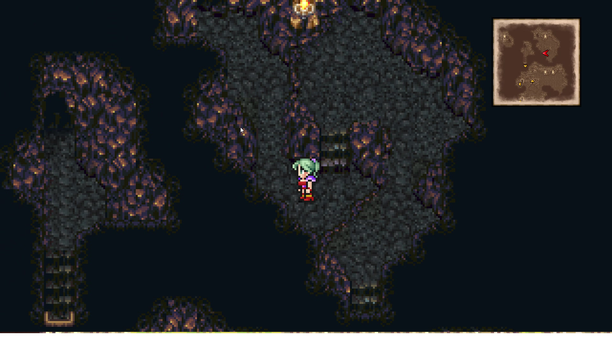

Figura 2: Exploração do mapa, momento anterior ao encontro. Fonte: Autores, 2026.

**Elementos de Interface**

- Personagem controlável posicionado sobre o mapa de uma caverna, sem qualquer HUD de combate visível.
- Minimapa no canto superior direito, indicando a posição atual e a topologia da área.

**Transições de Estado**

- O deslocamento do personagem pelo mapa é interrompido por um encontro, que substitui integralmente a tela de exploração pela tela de batalha.

**Regras de Negócio**

- O encontro **não é acionado por contato visível com um inimigo no mapa**: ele ocorre durante o deslocamento, caracterizando encontro aleatório associado à área.

**Base de Dados Inferida**

- **Leitura (Read):** ao disparar o encontro, o sistema consulta a tabela de encontros da área para determinar a formação de inimigos a ser instanciada.

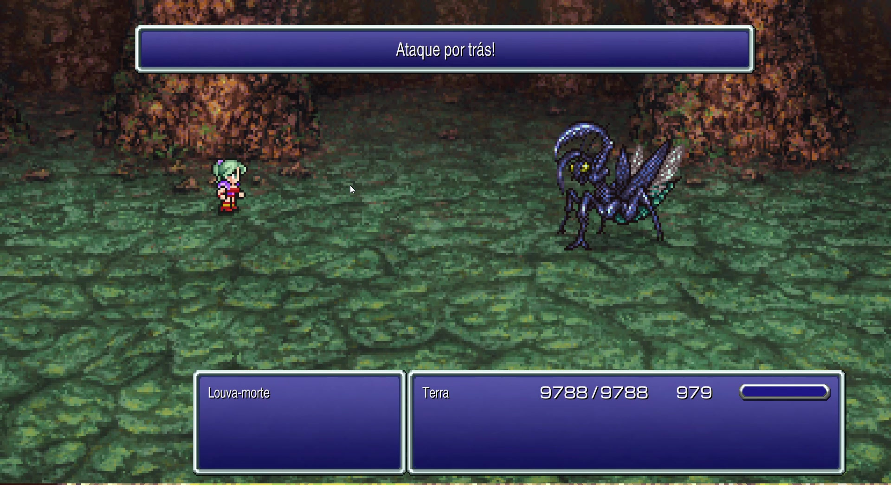

Figura 3: Tela inicial da batalha, com o aviso "Ataque por trás!". Fonte: Autores, 2026.

**Elementos de Interface**

- Faixa de texto no topo da tela com a mensagem "Ataque por trás!".
- Personagem à esquerda e inimigo à direita, em campo de batalha próprio, distinto do cenário de exploração.
- HUD inferior com duas caixas: a do inimigo, exibindo o nome "Louva-morte", e a do personagem, exibindo "Terra", PV 9788/9788, PM 979 e a barra de ATB **vazia**.

**Transições de Estado**

- A faixa de aviso é exibida apenas nos primeiros instantes da batalha e desaparece sem interação do jogador.
- A barra de ATB inicia vazia e passa a ser preenchida automaticamente, sem qualquer comando disponível ao jogador nesse intervalo.

**Regras de Negócio**

- O tipo de início da batalha é determinado **antes** do primeiro turno e é comunicado ao jogador por mensagem. Além do início normal, o sistema reconhece pelo menos as variantes de ataque preemptivo e ataque por trás (emboscada).
- O tipo de início condiciona o estado inicial do combate: no ataque por trás, a formação do grupo é invertida e a condição de partida é desfavorável ao jogador.

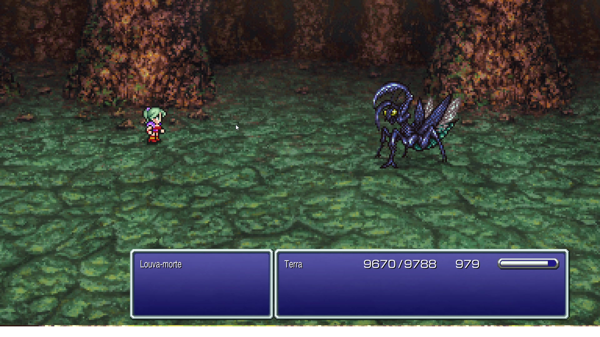

Figura 4: Barra de ATB em preenchimento, ainda sem menu disponível. Fonte: Autores, 2026.

**Elementos de Interface**

- Barra de ATB parcialmente preenchida na caixa do personagem.
- PV do personagem já reduzido para 9670/9788, evidenciando que o inimigo agiu enquanto a barra se enchia.

**Transições de Estado**

- Enquanto a barra não está cheia, o menu de comandos permanece **indisponível**: o jogador não pode agir, mas o inimigo pode.
- Quando a barra completa, o menu de comandos é aberto automaticamente para aquele personagem.

**Regras de Negócio**

- O combate é **em tempo real com fila de turnos**, e não alternado: personagem e inimigo preenchem barras independentes, de modo que o inimigo pode agir mais de uma vez entre dois turnos do jogador.
- A taxa de preenchimento da barra é função do atributo de velocidade do combatente.

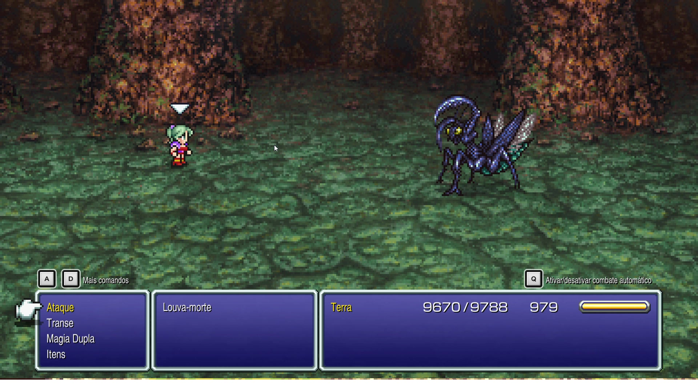

Figura 5: Menu de comandos aberto com a barra de ATB cheia. Fonte: Autores, 2026.

**Elementos de Interface**

- Menu de comandos do personagem com quatro entradas: **Ataque**, **Transe**, **Magia Dupla** e **Itens**.
- Cursor em forma de mão indicando a entrada selecionada e triângulo sobre o personagem ativo.
- Barra de ATB exibida cheia e destacada em amarelo, diferenciando-se visualmente do estado em preenchimento.
- Atalhos exibidos acima do menu: teclas A e D para "Mais comandos" e tecla Q para "Ativar/desativar combate automático".

**Transições de Estado**

- A abertura do menu **não congela o combate por completo**: o preenchimento das demais barras continua, o que caracteriza a variante ativa do sistema de turnos.
- A seleção de "Ataque" leva diretamente à escolha de alvo; a seleção de "Magia Dupla" ou "Itens" abre uma lista intermediária antes da escolha de alvo.

**Regras de Negócio**

- O conjunto de comandos é **específico do personagem**: "Transe" e "Magia Dupla" são habilidades da personagem Terra e não comandos genéricos do sistema.
- O sistema oferece um modo de combate automático, no qual as decisões de comando passam a ser tomadas pela própria aplicação.

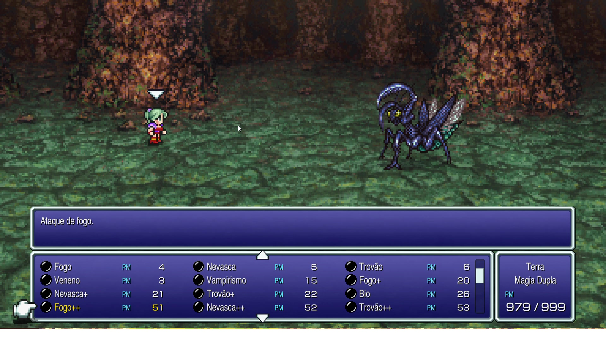

Figura 6: Lista de magias, com custo em PM e descrição contextual do feitiço selecionado. Fonte: Autores, 2026.

**Elementos de Interface**

- Grade de magias em três colunas, cada entrada com nome, rótulo "PM" e o respectivo custo — por exemplo, Fogo (4), Nevasca (5), Trovão (6), Fogo+ (20), Nevasca+ (21), Trovão+ (22), Bio (26), Fogo++ (51), Nevasca++ (52) e Trovão++ (53).
- Caixa de descrição acima da lista, atualizada conforme a seleção: com **Fogo++** em destaque, exibe "Ataque de fogo.".
- Caixa lateral com o nome do personagem, o comando em uso ("Magia Dupla") e o total de PM disponível: 979/999.
- Barra de rolagem vertical e setas indicando que a lista excede a área visível.

**Transições de Estado**

- A navegação pela lista **não consome o turno**: apenas atualiza a caixa de descrição.
- A confirmação de um feitiço encerra a lista e leva à seleção de alvo.

**Regras de Negócio**

- Cada magia possui um custo fixo em PM, e o custo cresce com o nível do feitiço dentro de uma mesma família elemental (Fogo 4 → Fogo+ 20 → Fogo++ 51).
- A lista disponível é a das magias **já aprendidas** pelo personagem, o que a vincula ao sistema de Magicites documentado adiante.

**Base de Dados Inferida**

- **Leitura (Read):** o sistema consulta a lista de magias aprendidas pelo personagem e, para cada uma, o custo em PM na tabela de feitiços, comparando-o com o PM atual para habilitar ou desabilitar a entrada.

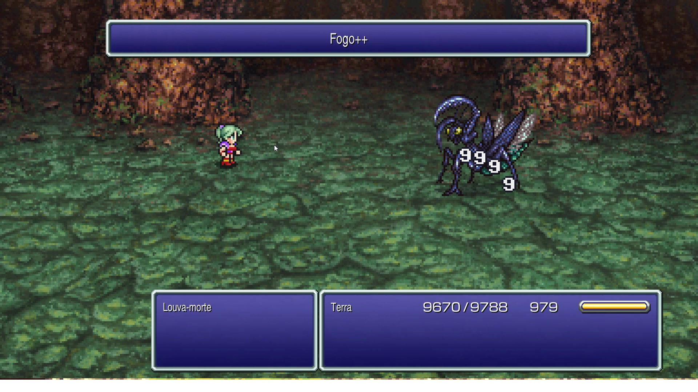

Figura 7: Execução do feitiço, com faixa de nome e número de dano sobre o inimigo. Fonte: Autores, 2026.

**Elementos de Interface**

- Faixa superior com o nome do feitiço executado ("Fogo++").
- Animação do efeito sobre o inimigo e número de dano exibido sobre o alvo (3999).

**Transições de Estado**

- Durante a animação, o menu permanece fechado e a barra de ATB do personagem é zerada, reiniciando o ciclo de preenchimento.
- Após a aplicação do dano, o sistema avalia se o alvo foi derrotado e, em caso afirmativo, remove seu sprite do campo.

**Regras de Negócio**

- O custo do feitiço é debitado do PM no momento da execução: o total cai de 979 para 928, exatamente os 51 PM de Fogo++.
- O valor do dano é calculado no momento da execução e apresentado numericamente, o que indica cálculo por fórmula com variância, e não valor fixo por feitiço.

**Base de Dados Inferida**

- **Escrita (Update):** o sistema atualiza o PM do personagem e o PV do alvo ao final da execução.

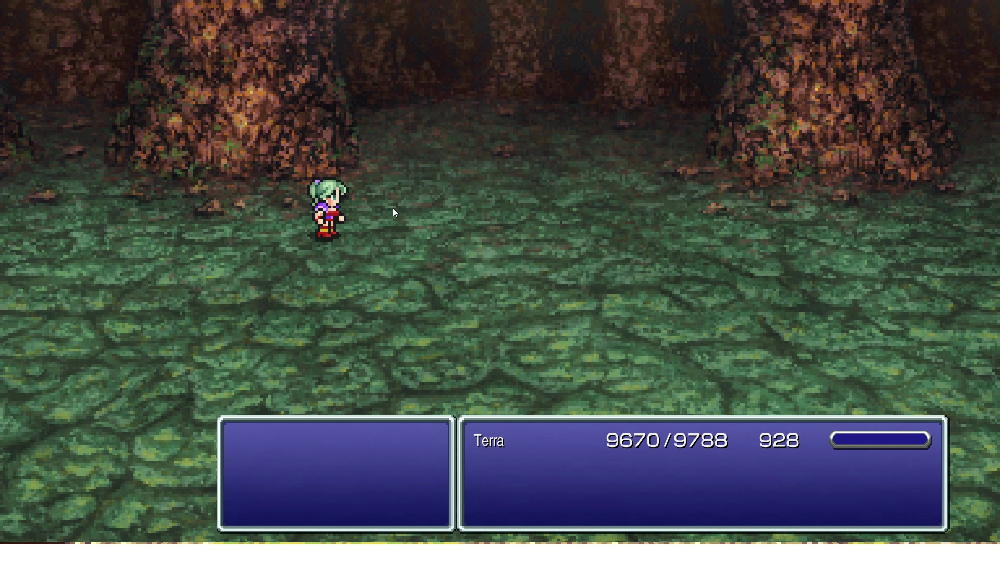

Figura 8: Campo de batalha após a derrota do inimigo, antes da tela de recompensa. Fonte: Autores, 2026.

**Elementos de Interface**

- Caixa do inimigo esvaziada no HUD e sprite removido do campo.
- Caixa do personagem mantendo PV 9670/9788 e PM já reduzido para 928.

**Transições de Estado**

- Com a derrota do último inimigo em campo, a condição de fim de batalha é satisfeita e o sistema encerra o loop de turnos, avançando para a apuração de recompensas.

**Regras de Negócio**

- A batalha termina quando **todos** os inimigos da formação são derrotados; a derrota de um único alvo não encerra o combate se restarem outros.

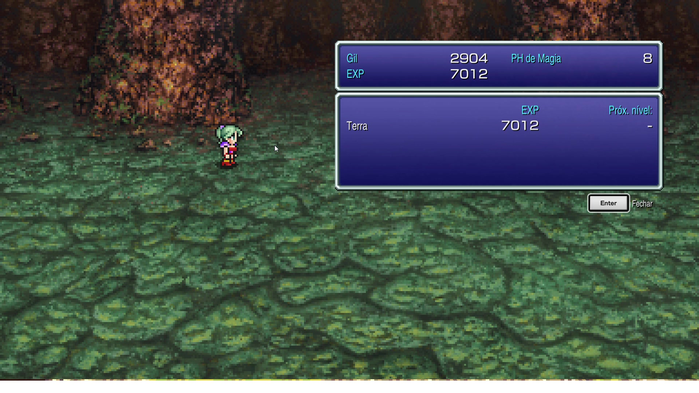

Figura 9: Tela de recompensa, com Gil, EXP e PH de Magia distribuídos. Fonte: Autores, 2026.

**Elementos de Interface**

- Caixa superior com os totais obtidos pelo grupo: **Gil** 2904, **EXP** 7012 e **PH de Magia** 8.
- Caixa inferior com uma linha por personagem, exibindo a EXP recebida (Terra, 7012) e a coluna "Próx. nível", aqui preenchida com um traço.
- Botão de confirmação rotulado "Enter — Fechar".

**Transições de Estado**

- A tela de recompensa **exige confirmação do jogador** para ser fechada, não desaparecendo automaticamente.
- Confirmada a recompensa, o sistema retorna à tela de exploração.

**Regras de Negócio**

- A recompensa é composta por três moedas distintas: Gil (economia), EXP (progressão de nível) e PH de Magia (progressão de magias via Magicite), o que liga o encerramento da batalha ao Sistema de Magicites.
- A coluna "Próx. nível" exibe traço quando o personagem já está no nível máximo, indicando que a EXP recebida não altera seu nível.

**Base de Dados Inferida**

- **Escrita (Update):** o sistema credita Gil ao grupo e, para cada personagem sobrevivente, acumula EXP e PH de Magia em seu registro de progressão.

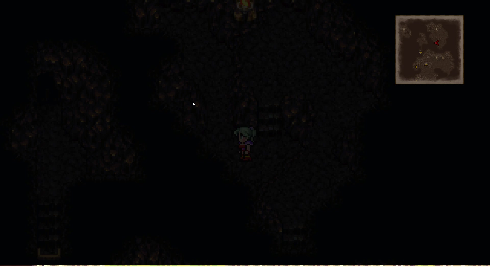

Figura 10: Retorno à tela de exploração após o encerramento da batalha. Fonte: Autores, 2026.

**Elementos de Interface**

- Tela de exploração restaurada, com o personagem na mesma posição em que o encontro ocorreu e o minimapa novamente visível.

**Transições de Estado**

- O retorno preserva a posição do personagem no mapa: a batalha é um estado sobreposto à exploração, e não uma mudança de área.

**Regras de Negócio**

- O inimigo derrotado **não permanece** no mapa após a vitória, confirmando que a instância de combate é descartada ao final da batalha.

**Síntese: entidades e atributos recuperados**

Conforme orienta a literatura, a engenharia reversa não se encerra no inventário de detalhes: o tratamento dos fatos consiste em abstrair, a partir deles, informações em nível mais alto. Consolidando o observado nas nove telas, o domínio do Motor de Batalha compõe-se das seguintes entidades:

| Entidade | Atributos evidenciados em tela |
|---|---|
| Personagem | nome, PV atual/máximo, PM atual/máximo, progresso da barra de ATB, EXP acumulada, nível, comandos disponíveis |
| Magia | nome, custo em PM, elemento, descrição textual, nível dentro da família elemental |
| Inimigo | nome, PV, recompensas concedidas ao ser derrotado |
| Recompensa | Gil, EXP e PH de Magia |
| Encontro | área associada, formação de inimigos, tipo de início |

Tabela 1: Entidades e atributos recuperados do Motor de Batalha. Fonte: Autores, 2026.

**Limitações da observação**

O fluxo foi recuperado a partir de **uma única batalha**, com um personagem e um inimigo. Permanecem, portanto, **não observados**: a ordem de turnos entre múltiplos personagens do grupo, o comportamento com múltiplos inimigos em campo, o encerramento por **fuga** e o encerramento por **derrota**. Os dois últimos aparecem no modelo BPMN por serem saídas necessárias do processo, mas foram inferidos a partir do gênero e das convenções do sistema legado, e não registrados em captura, o que os torna candidatos naturais a uma próxima rodada de observação.

#### Coliseu

As capturas de tela a seguir, extraídas do vídeo do canal carnage panda (CARNAGE PANDA, 2022), documentam a sequência completa do fluxo de aposta do Coliseu. Para cada uma, são listados os elementos de interface, as transições de estado e as regras de negócio identificados naquela etapa específica.

Figura 11: Diálogo inicial do guarda da entrada do Coliseu. Fonte: CARNAGE PANDA, 2022.

**Elementos de Interface**

- Caixa de diálogo do guarda, exibindo a pergunta "Care to fight in the coliseum?".
- Menu textual de resposta com três opções: "With pleasure!", "No thanks." e "Could you explain?", exibido como uma segunda caixa sobreposta à caixa de diálogo, sem ocultá-la.

**Transições de Estado**

- A caixa de pergunta do guarda **não é ocultada** quando o menu de respostas surge: as duas caixas ficam visíveis simultaneamente, caracterizando uma sobreposição (overlay) e não uma substituição de tela.
- Ao clicar em "Could you explain?", o software exibe uma explicação textual das mecânicas do Coliseu e, em seguida, **retorna** à mesma pergunta inicial do guarda, configurando um laço (loop) no fluxo.
- Ao clicar em "No thanks.", o fluxo é encerrado e a tela retorna ao jogo normal, fora do Coliseu.
- Ao clicar em "With pleasure!", a tela do guarda é substituída integralmente pela tela de seleção de item para aposta (Figura 3).

Figura 12: Lista de itens do inventário disponíveis para aposta. Fonte: CARNAGE PANDA, 2022.

**Elementos de Interface**

- Lista/aba de itens do inventário do jogador disponíveis para aposta, rolada verticalmente.

**Transições de Estado**

- Ao clicar em um item da lista, o software **não remove** o item nem avança diretamente, em vez disso, sobrepõe o modal de confirmação "Bet this item?" (Figura 4).

**Regras de Negócio**

- A lista de itens apostáveis é composta exclusivamente pelos itens presentes no inventário atual do jogador, não há itens exclusivos do Coliseu na lista.

**Base de Dados Inferida**

- **Leitura (Read):** Para popular a lista da interface, o sistema realiza uma consulta de leitura na base de dados "Inventário do Jogador", filtrando os itens disponíveis para aposta e excluindo itens que já estão equipados.

Figura 13: Modal de confirmação do item apostado. Fonte: CARNAGE PANDA, 2022.

**Elementos de Interface**

- Modal de confirmação da aposta, com a pergunta "Bet this item?" e as opções "Yes" / "No".

**Transições de Estado**

- Clicar em "No" fecha o modal e retorna à tela de seleção de item (Figura 3).
- Clicar em "Yes" avança para a tela de seleção de personagem (Figura 5).

**Regras de Negócio**

- O item apostado só é efetivamente removido do inventário no momento em que um personagem é selecionado para o combate (Figura 5), e não neste momento de confirmação, ou seja, a aposta só se torna irreversível quando o combate está prestes a começar.

Figura 14: Seleção do personagem combatente, com item apostado, item de recompensa e adversário exibidos. Fonte: CARNAGE PANDA, 2022.

**Elementos de Interface**

- Painéis superiores fixos com o item apostado (ex.: "Flametongue") e o item prometido como recompensa (ex.: "Organyx").
- Rótulo central "VS." com o nome do adversário (ex.: "Great Malboro") e o nome do personagem em destaque (ex.: "Shadow").
- Lista de seleção com cursor, exibindo todos os personagens da party atual disponíveis para o combate, e botão de confirmação "Confirm".

**Transições de Estado**

- Qualquer escolha de personagem da party avança para a tela de combate automático (Figura 6), não há opção de retorno a essa altura do fluxo.

**Regras de Negócio**

- Apenas um personagem da party atual participa do combate por vez: o Coliseu isola o combatente selecionado, mesmo que a party tenha múltiplos membros disponíveis.

**Base de Dados Inferida**

- **Leitura (Read):** O sistema consulta a base de dados "'Party' do Jogador" para listar os personagens atualmente disponíveis e aptos para a arena.
- **Atualização/Deleção (Update/Delete):** No exato momento em que o jogador confirma o personagem, o sistema executa a remoção definitiva do item apostado da base de dados "Inventário do Jogador".

Figura 15: Combate automático entre o personagem escolhido e o adversário. Fonte: CARNAGE PANDA, 2022.

**Elementos de Interface**

- Arena de combate automático, sem menu de comandos do jogador.

**Transições de Estado**

- Ao final do combate, a tela é substituída pela tela de vitória (Figura 7) ou de derrota (Figura 8), dependendo do resultado, sem intervenção do jogador durante a transição.

**Regras de Negócio**

- O jogador **não tem controle** sobre as ações do personagem durante o combate: a batalha do Coliseu é inteiramente automática/simulada pelo sistema, ao contrário do combate ATB padrão do modo aventura.

Figura 16: Tela de vitória, com a entrega do item de recompensa. Fonte: CARNAGE PANDA, 2022.

**Elementos de Interface**

- Tela de resultado de vitória, com animação do personagem e contadores de Gil, EXP e Magic AP ganhos.

**Regras de Negócio**

- Em caso de vitória, os ganhos usuais de batalha são zerados (0 de Gil, 0 de EXP e 0 de Magic AP) e, em seu lugar, o jogador recebe o item prometido como recompensa: o Coliseu segue, portanto, uma lógica de recompensa própria, distinta do combate convencional.

**Base de Dados Inferida**

- **Escrita (Create/Insert):** O sistema insere o novo item (recompensa) na base de dados "Inventário do Jogador".

Figura 17: Tela de derrota, sem concessão de recompensa. Fonte: CARNAGE PANDA, 2022.

**Elementos de Interface**

- Transição "Fade to black" ao final da animação de derrota do personagem.

**Regras de Negócio**

- Em caso de derrota, o item apostado é **permanentemente perdido** (não retorna ao inventário) e nenhuma recompensa é concedida, caracterizando uma mecânica de risco: o jogador aposta um item na expectativa de ganhar outro, podendo perder o que apostou.

#### Sistema de Magicite em Final Fantasy VI

O sistema de **Magicite** de Final Fantasy VI está diretamente relacionado aos **Espers**, permitindo que os personagens aprendam magias, recebam bônus permanentes de atributos e invoquem os respectivos Espers durante as batalhas.

**O que é Magicite?**

A **Magicite** representa a essência de um Esper e pode ser equipada pelos personagens. Ao equipá-la, o personagem passa a ter acesso à invocação daquele Esper durante as batalhas, podendo causar dano aos inimigos, aplicar efeitos positivos ao grupo ou produzir outros efeitos especiais.

Além da possibilidade de invocação, cada Magicite possui características próprias relacionadas ao **aprendizado de magias** e, em alguns casos, à **evolução dos atributos do personagem**.

**Aprendizado de Magias e Taxa de Aquisição**

Cada Esper associado a uma Magicite pode ensinar uma ou mais magias. Para cada magia existe uma **taxa de aquisição**, que determina a quantidade de **Magic AP** necessária para aprendê-la.

Ao final de cada batalha, o personagem equipado com uma Magicite recebe Magic AP. Esse valor é utilizado para aumentar o percentual de aprendizado das magias ensinadas pela Magicite.

A taxa funciona da seguinte maneira:

- **Taxa 10:** cada Magic AP representa 10% de aprendizado, sendo necessários 10 Magic AP para aprender a magia completamente.
- **Taxa 5:** cada Magic AP representa 5% de aprendizado, sendo necessários 20 Magic AP.
- **Taxa 2:** cada Magic AP representa 2% de aprendizado, sendo necessários 50 Magic AP.

Por exemplo:

| Magia | Taxa de aquisição | Magic AP necessários |
|:---|:---:|:---:|
| Thunder | 10% | 10 |
| Poison | 5% | 20 |
| Thundara | 2% | 50 |

A Magicite deve permanecer equipada enquanto o personagem estiver adquirindo Magic AP. Quando a magia atingir **100% de aprendizado**, ela é permanentemente adicionada ao repertório do personagem e continua disponível mesmo após a remoção da Magicite.

**Múltiplos Espers ensinando a mesma magia**

Uma mesma magia pode ser ensinada por diferentes Espers, sendo que cada um pode apresentar uma **taxa de aquisição diferente**.

Isso permite que o jogador escolha estrategicamente qual Magicite equipar de acordo com as magias que deseja aprender mais rapidamente.

Alguns exemplos são:

- **Ramuh:** ensina Thunder com uma taxa específica de aquisição.
- **Maduin:** ensina as magias elementais de segundo nível, como Thundara, Fira e Blizzara, com taxa 3.
- **Bismarck:** ensina as magias elementais de primeiro nível, como Thunder, Blizzard e Fire, com taxa 20, exigindo apenas 5 Magic AP para o aprendizado completo.

Dessa forma, o jogador pode otimizar a distribuição das Magicites de acordo com as necessidades de cada personagem.

**Bônus de Atributos ao Subir de Nível**

Além do aprendizado de magias, algumas Magicites concedem **bônus permanentes de atributos** quando o personagem sobe de nível enquanto está equipado com elas.

Entre os exemplos estão:

- **Ramuh:** +1 de Stamina por nível adquirido.
- **Sylph/Siren:** +10% de HP ganho ao subir de nível.
- **Kirin/Cactuar:** +1 de Magic por nível adquirido.

Esse sistema possibilita uma estratégia mais avançada de desenvolvimento dos personagens. O jogador pode trocar as Magicites antes de determinados níveis para direcionar o crescimento dos atributos e, consequentemente, construir personagens com valores elevados de **HP, MP, Magic ou Stamina**.

**Estratégia de Progressão e Grinding**

Uma estratégia utilizada por jogadores que desejam otimizar os atributos dos personagens consiste em evitar ganhar níveis excessivamente cedo no jogo.

Isso ocorre porque os bônus de atributos fornecidos pelas Magicites são aplicados **no momento em que o personagem sobe de nível**. Portanto, subir de nível antes de obter Magicites com bônus mais vantajosos pode resultar na perda de oportunidades de otimização dos atributos.

Assim, alguns jogadores procuram avançar pelo jogo mantendo os personagens em níveis relativamente baixos até alcançar o **World of Ruin**, período em que uma quantidade maior de Magicites está disponível. A partir desse momento, torna-se possível planejar os níveis seguintes e utilizar diferentes Magicites para maximizar os atributos desejados.

**Empilhamento de Taxas com Equipamentos**

Alguns equipamentos também podem contribuir para o aprendizado de determinadas magias. Quando o equipamento e a Magicite ensinam a mesma magia, suas taxas podem ser **combinadas**, reduzindo o número de batalhas necessárias para completar o aprendizado.

Um exemplo é a magia **Ultima**:

- **Escudo Paladin:** taxa de 1%.
- **Magicite Ragnarok:** taxa de 1%.
- **Ambos equipados:** taxa combinada de 2%.

Nesse caso, o personagem precisaria de aproximadamente **50 Magic AP**, em vez dos 100 necessários quando possui apenas uma fonte com taxa de 1%.

**Objetivo e Resultado do Sistema**

O sistema de Magicite cria uma relação entre **progressão, personalização e estratégia**. O jogador precisa decidir quais Magicites equipar, quais magias deseja priorizar e, em determinados momentos, quais atributos deseja desenvolver.

Com tempo suficiente e um planejamento adequado, é possível fazer com que diferentes personagens aprendam uma grande variedade de magias e desenvolvam atributos elevados. Como consequência, os personagens tornam-se mais **flexíveis e intercambiáveis**, permitindo diferentes combinações e estratégias durante a progressão e, principalmente, no conteúdo de final de jogo.

#### Blitz

Para o levantamento do fluxo do Blitz, foi observado o vídeo "Final Fantasy 6- How to do Blitz" (KITTYFRIESVG, [s. d.]), no qual a habilidade é selecionada em combate, e o playthrough completo do jogo (TYKIROU, 2021).

**Elementos de Interface**

- Menu de comandos do combate, com a opção Blitz selecionável para o personagem.

**Transições de Estado**

- Ao selecionar a opção Blitz durante o combate, o sistema revela que a habilidade é executada por meio de uma sequência de direções a ser inserida no direcional.
- No exemplo observado, a sequência exigida para a execução foi **esquerda, direita, esquerda** (left, right, left).

**Regras de Negócio**

- O Blitz é uma habilidade exclusiva do personagem Sabin, executada pela entrada de uma sequência direcional correta, em vez da seleção convencional de alvo de um comando.

### Modelagem BPMN

### Motor de Batalha (ATB)

O fluxo do Motor de Batalha foi modelado em três frames encadeados por eventos de link, além de um frame de legenda. A separação evita um diagrama único ilegível e isola o subprocesso de mistura de elementos químicos, que é a mecânica distintiva do projeto.

É preciso distinguir dois momentos no modelo. Os **frames 1 e 3** são produto direto da engenharia reversa: reproduzem, em nível de processo, o comportamento observado no sistema legado. Já o **frame 2 é produto de reengenharia**. Conforme a literatura, enquanto a engenharia reversa se limita a analisar o sistema e criar uma representação dele, a reengenharia parte dessa representação para montar uma nova estrutura que cumpre a mesma função **sem ser mera cópia**. Foi o que se fez aqui: a representação recuperada do comando de magia — acionado pelo menu, abre lista intermediária, consome um recurso do personagem, produz efeito com elemento e potência e só então segue para a seleção de alvo — foi preservada como **estrutura**, e seu mecanismo interno foi substituído pela mistura de elementos químicos do G4_ProjetoJogo. O quadro a seguir explicita a transposição:

| Estrutura recuperada de Final Fantasy VI | Reengenharia no G4_ProjetoJogo |
|---|---|
| Comando de magia no menu do personagem | Comando Misturar no menu do personagem |
| Lista de magias já aprendidas | Bancada portátil de dois slots com os reagentes coletados |
| Custo fixo em PM por feitiço | Consumo dos reagentes selecionados |
| Efeito com elemento e potência definidos na tabela de feitiços | Composto com elemento, potência e status definidos na tabela de reações |
| Magias aprendidas acumuladas via PH de Magia | Receitas descobertas acumuladas no Livro do Aventureiro |
| Feitiço sempre bem-sucedido | Desfecho incerto: composto estável, tentativa malsucedida ou backfire |

Tabela 2: Transposição por reengenharia do comando de magia para a mistura de elementos químicos. Fonte: Autores, 2026.

A última linha é a decisão de projeto mais relevante da transposição: introduzir incerteza no resultado cria o ciclo de descoberta e registro de receitas que sustenta a ênfase em Jogabilidade do projeto, ausente no sistema de origem.

**Legenda da notação**

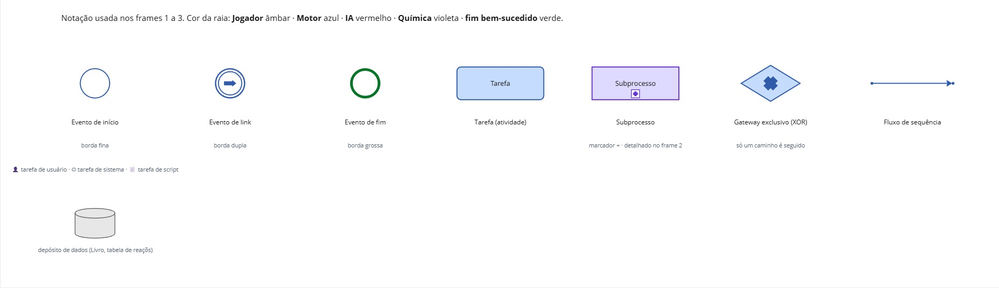

Figura 18: Legenda da notação BPMN utilizada nos frames do Motor de Batalha. Fonte: Marcelo, 2026.

**Frame 1 — Loop de batalha (ATB)**

Diagrama com três raias: **Jogador**, **Motor de Batalha (ATB)** e **IA Inimiga**. Cobre a montagem da formação, o tipo de início (Normal, Preemptivo ou Emboscada), o preenchimento da barra de ATB por velocidade, a decisão de turno, o menu de comandos (Atacar, Magia, Item, Defender), o cálculo de dano com fórmula, elemento, fraqueza e variância, e a checagem de fim de batalha.

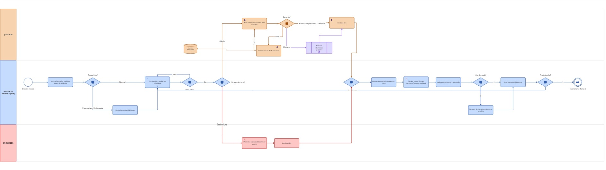

Figura 19: Modelo BPMN do frame 1 — loop de batalha (ATB). Fonte: Marcelo, 2026.

**Frame 2 — Subprocesso: Mistura de Elementos Químicos**

Detalha o subprocesso acionado pelo comando Misturar: abertura da bancada portátil de dois slots, escolha dos reagentes, consulta à tabela de reações e os desfechos possíveis — composto estável com registro de receita nova no Livro do Aventureiro, tentativa malsucedida com reagentes gastos, ou backfire com dano no lançador.

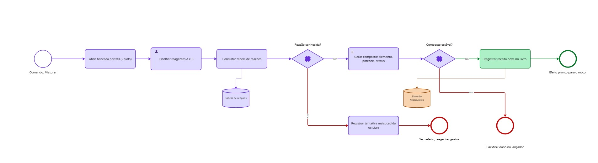

Figura 20: Modelo BPMN do frame 2 — subprocesso de mistura de elementos químicos. Fonte: Marcelo, 2026.

**Frame 3 — Encerramento da batalha**

Trata os três resultados possíveis: **vitória** (distribuição de EXP, GP e drops, atualização do bestiário e das receitas no Livro, oferta de gravação no próximo Savepoint), **fuga** (inimigo permanece vivo no mapa) e **derrota** (tela de derrota e recarga do último Savepoint).

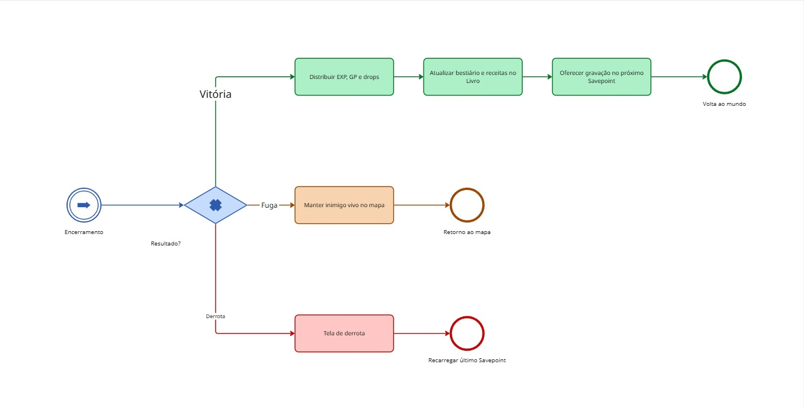

Figura 21: Modelo BPMN do frame 3 — encerramento da batalha. Fonte: Marcelo, 2026.

**Rastreabilidade entre a observação e o modelo**

Cada decisão estrutural do frame 1 tem origem em uma evidência registrada na seção de engenharia reversa:

| Evidência observada | Elemento correspondente no BPMN |
|---|---|
| Mensagem "Ataque por trás!" na abertura (Figura 3) | Gateway Tipo de início? com as saídas Normal e Preemptivo/Emboscada |
| Barra em preenchimento enquanto o PV do personagem cai (Figura 4) | Tarefa Tick do ATB em laço e raia independente da IA Inimiga |
| Menu com Ataque, Transe, Magia Dupla e Itens (Figura 5) | Gateway Comando? e suas ramificações |
| Lista de magias com custo em PM (Figura 6) | Tarefa de escolha do efeito, anterior à seleção de alvo |
| Queda de 979 para 928 PM após um feitiço de custo 51 (Figura 7) | Tarefa Consumir custo (PM / reagentes / item) |
| Número de dano exibido sobre o alvo (Figura 7) | Tarefas Calcular efeito e Aplicar dano |
| Sprite do inimigo removido do campo (Figura 8) | Gateway Alvo derrotado? e tarefa de remoção do campo |
| Tela com Gil, EXP e PH de Magia (Figura 9) | Tarefa Distribuir EXP, GP e drops, no frame 3 |

Tabela 3: Rastreabilidade entre as telas observadas e os elementos do modelo BPMN. Fonte: Autores, 2026.

**Quadro interativo**

O modelo completo, com os quatro frames lado a lado, pode ser navegado no quadro abaixo.

  <iframe
    src="https://miro.com/app/live-embed/uXjVHuom1xM=/?embedId=bpmn-motor-batalha"
    style="position:absolute;top:0;left:0;width:100%;height:100%;border:1px solid rgba(128,128,128,.35);border-radius:6px;"
    frameborder="0" scrolling="no" allow="fullscreen; clipboard-read; clipboard-write" allowfullscreen>
  </iframe>

Quadro 1: Modelo BPMN do Motor de Batalha (ATB) em quadro interativo. Fonte: Marcelo, 2026.

Abrir em nova aba: <a href="https://miro.com/app/board/uXjVHuom1xM=/" target="_blank" rel="noopener">BPMN — Motor de Batalha (Miro)</a>.

#### Coliseu

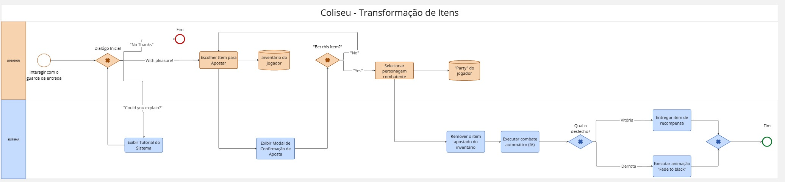

Figura 22: Modelo BPMN do fluxo do sistema do Coliseu. Fonte: SILVA, Marcos (2026).

### Sistema de Magicites

Figura 23: Modelo BPMN do fluxo do Sistema de Magicites. Fonte: SOBRENOME, Nome (2026).

### Habilidades Exclusivas

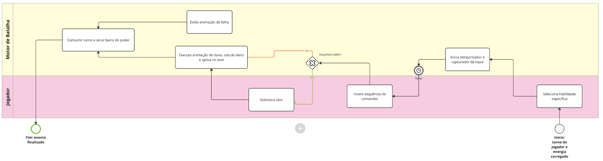

Figura 24: Modelo BPMN do fluxo do sistema de Habilidades Exclusivas (Blitz). Fonte: FARIAS, João (2026).

## Referências

BRAGA, Rosana T. Vaccare; PENTEADO, Rosângela. **Engenharia Reversa e Reengenharia**. Material da disciplina SCE 186 – Engenharia de Software. [S. l.: s. n.], [s. d.].

CARNAGE PANDA. **Final Fantasy 6 Pixel Remaster #41 - Coliseum**. YouTube, 5 abr. 2022. Disponível em: https://www.youtube.com/watch?v=vAIxn-R0GFM. Acesso em: 25 ago. 2026.

KITTYFRIESVG. **Final Fantasy 6- How to do Blitz**. YouTube, [10 de abril de 2010]. Disponível em: https://www.youtube.com/watch?v=AZbmj0W2gFw. Acesso em: 27 ago. 2026.

TYKIROU. **Final Fantasy VI (1994 | 2021) | PC | Full Playthrough - Part 1**. YouTube, [18 de fevereiro de 2025]. Disponível em: https://www.youtube.com/watch?v=CXzormM9XHI. Acesso em: 27 ago. 2026.

WIKIPÉDIA. **Final Fantasy VI**. Disponível em: https://en.wikipedia.org/wiki/Final_Fantasy_VI. Acesso em: 27 ago. 2026.

## Nível de Contribuição dos Integrantes

| Nome | % de Contribuição |
|------|-------------------|
| João Igor Pereira da Costa | 25,0% |
| João Victor da Silva Batista de Farias | 25,0% |
| Marcelo de Araújo Lopes | 25,0% |
| Marcos Vinícius Gündel da Silva | 25,0% |

Tabela 4: Contribuição dos integrantes.

## Histórico de Versão

| Versão | Data | Descrição | Autor(es) | Revisor |
|:------:|------|:----------|:----------|:--------|
| 1.0 | 22/08/2026 | Criação da página no modelo do artefato padrão | Marcelo de Araújo Lopes | Marcos Vinícius Gündel da Silva |
| 1.1 | 25/08/2026 | Preenchimento do processo de Engenharia Reversa aplicado ao Coliseu (FF6): metodologia e, para cada tela do fluxo, os elementos de interface, as transições de estado e as regras de negócio identificados | Marcos Vinícius Gündel da Silva | |
| 1.2 | 26/08/2026 | Preenchimento do processo de Engenharia Reversa aplicado ao Sistema de Magicites (FF6): metodologia e conteúdo gerado | João Igor Pereira da Costa | |
| 1.3 | 26/08/2026 | Adição dos comandos do Banco de Dados Inferido por tela no processo de Engenharia Reversa do Coliseu | Marcos Vinícius Gündel da Silva | |
| 1.4 | 26/08/2026 | Adição do BPMN do fluxo do Coliseu e placeholders para os outros sistemas | Marcos Vinícius Gündel da Silva | |
| 1.5 | 27/08/2026 | Adição do BPMN do fluxo de Habilidades Exclusivas (Blitz) e criação da seção de Engenharia Reversa do Blitz | João Victor da Silva Batista de Farias | |
| 1.6 | 27/08/2026 | Preenchimento do processo de Engenharia Reversa aplicado às Habilidades Exclusivas (Blitz): metodologia, fluxo e referências | João Victor da Silva Batista de Farias | |
| 1.7 | 27/08/2026 | Adição do BPMN do Motor de Batalha (ATB) em três frames com legenda da notação, quadro interativo do Miro e renumeração das figuras subsequentes | Marcelo de Araújo Lopes | |
| 1.8 | 28/08/2026 | Preenchimento da Engenharia Reversa do Motor de Batalha (ATB), com o quadro de reengenharia do frame 2 e a rastreabilidade com o BPMN | Marcelo de Araújo Lopes | |

Tabela 5: Histórico de versão.

Ver também: [Artefato Generalista](ArtefatoGeneralista.md) · [Léxico](Lexico.md) · [Rich Picture](RichPicture.md) · [NFR Framework](NFRFramework.md) · [IA Generativa](IAGenerativa.md)
